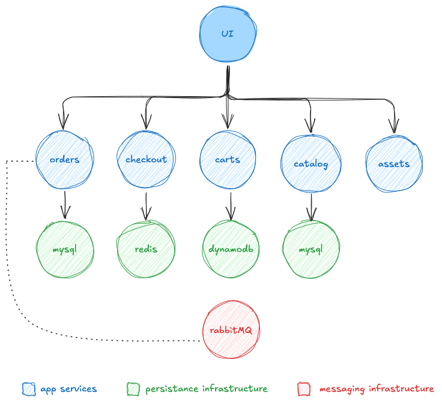

#### Sample Application

Most labs in this workshop use a common sample application that provides containerized components to work with during the exercises. The application models a simple web store where customers can browse a catalog, add items to their cart, and complete orders through a checkout process.

The application includes several components and dependencies:

**Sample Application Architecture:**

| Component      | Description                                                                 |
|----------------|-----------------------------------------------------------------------------|
| UI             | Frontend user interface that aggregates API calls to other services         |
| Catalog        | API providing product listings and details                                  |
| Cart           | API managing customer shopping carts                                        |
| Checkout       | API orchestrating the checkout process                                      |
| Orders         | API responsible for receiving and processing customer orders                |
| Static Assets  | Serves static files such as product images                                  |

The complete source code is available on [GitHub](https://github.com/aws-containers/retail-store-sample-app).

---

#### Packaging Container Workloads

Before deploying workloads to Amazon ECS, they must be packaged as container images and published to a container registry. While this workshop does not cover basic containerization concepts, pre-built container images for the sample application are available in Amazon Elastic Container Registry (ECR) for use in the labs.

Below is a table with links to the ECR repositories and corresponding Dockerfiles:

| Component      | ECR Repository                                                                                 | Dockerfile                                                                                                           |
|----------------|-----------------------------------------------------------------------------------------------|----------------------------------------------------------------------------------------------------------------------|
| UI             | [Link](https://gallery.ecr.aws/aws-containers/retail-store-sample-ui)                         | [Dockerfile](https://github.com/aws-containers/retail-store-sample-app/blob/0.8.5/src/ui/Dockerfile)               |
| Catalog        | [Link](https://gallery.ecr.aws/aws-containers/retail-store-sample-catalog)                    | [Dockerfile](https://github.com/aws-containers/retail-store-sample-app/blob/0.8.5/src/catalog/Dockerfile)          |
| Shopping Cart  | [Link](https://gallery.ecr.aws/aws-containers/retail-store-sample-cart)                       | [Dockerfile](https://github.com/aws-containers/retail-store-sample-app/blob/0.8.5/src/cart/Dockerfile)             |
| Checkout       | [Link](https://gallery.ecr.aws/aws-containers/retail-store-sample-checkout)                   | [Dockerfile](https://github.com/aws-containers/retail-store-sample-app/blob/0.8.5/src/checkout/Dockerfile)         |
| Orders         | [Link](https://gallery.ecr.aws/aws-containers/retail-store-sample-orders)                     | [Dockerfile](https://github.com/aws-containers/retail-store-sample-app/blob/0.8.5/src/orders/Dockerfile)           |
| Assets         | [Link](https://gallery.ecr.aws/aws-containers/retail-store-sample-assets)                     | [Dockerfile](https://github.com/aws-containers/retail-store-sample-app/blob/0.8.5/src/assets/Dockerfile)           |

---

#### Expected Results

The **Fundamentals** section will help you develop a solid understanding of key Amazon ECS and AWS Fargate concepts, including clusters, task definitions, services, networking, and deployment architecture. By the end of this section, you will be able to confidently deploy containerized workloads on AWS using ECS and Fargate.

---

#### Pricing Overview

This workshop utilizes various AWS services such as VPC networking, ECS (Fargate launch type), and Application Load Balancer (ALB). The cost estimates below are based on the **Asia Pacific (Sydney)** region and assume typical usage patterns for a demo or development environment.

You can view and customize this estimate using the [AWS Pricing Calculator](https://calculator.aws/#/estimate?id=850c71ae0c1cbf130c921383ceb3c5907f83e46c).

| Service Name                    | Description                        | Monthly Cost (USD) | 12-Month Cost (USD) |
|--------------------------------|------------------------------------|--------------------|---------------------|
| **AWS Fargate**                | Containerized task execution       | $28.81             | $345.72             |
| **Application Load Balancer**  | Distributes traffic to ECS tasks   | $33.00             | $396.00             |
| **Data Transfer**              | Internet & inter-service traffic   | $0.00              | $0.00               |
| **NAT Gateway**                | Enables outbound internet access   | $43.13             | $517.56             |
| **Gateway Load Balancer**      | Handles advanced traffic filtering | $34.10             | $409.20             |
