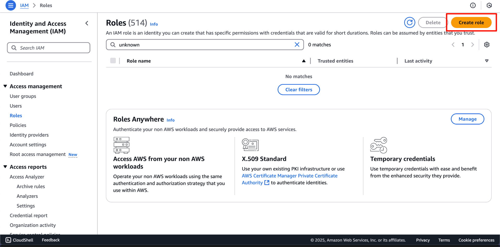
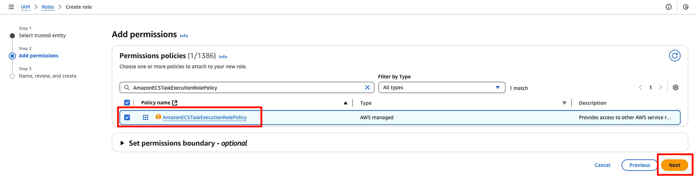
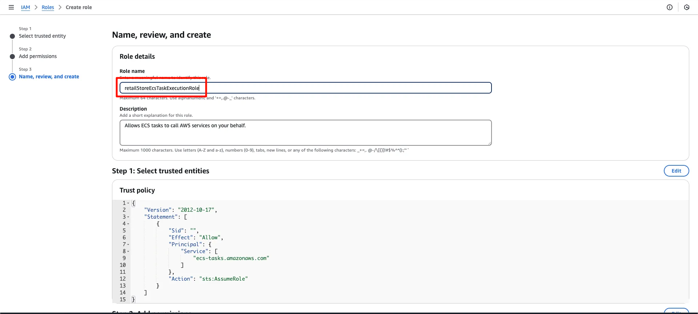
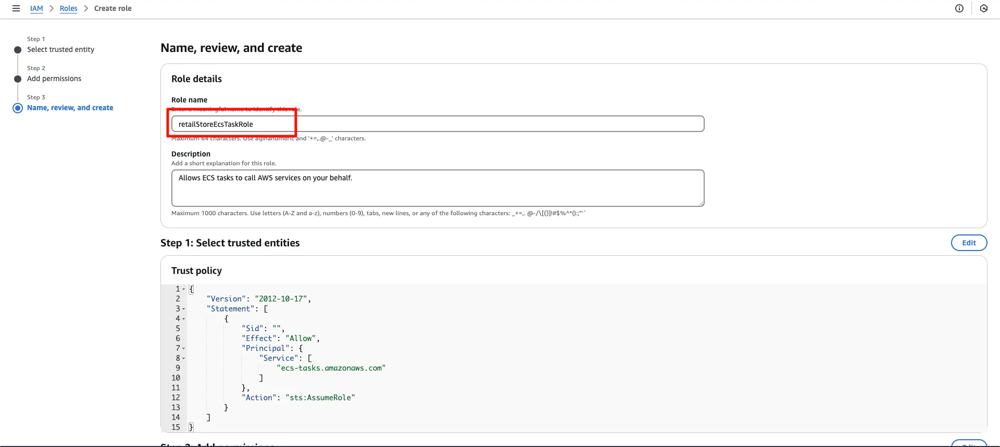
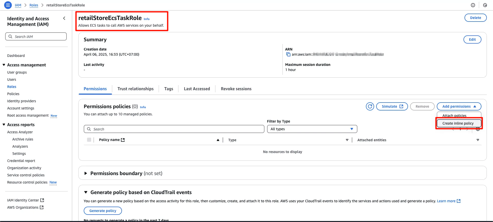

### Giới thiệu

<!-- TODO: Thêm hình ảnh IAM Role -->
IAM Role là tính năng giúp nâng cao tính bảo mật trên AWS. Một IAM Role có thể được gán tạm thời cho các IAM User và các tài nguyên AWS trong nội bộ (internal) hoặc bên ngoài (external) tài khoản của bạn. Giả sử, khi một IAM User tiếp nhận (assume) một IAM Role, IAM User đó sẽ tạm thời có được những quyền hạn của IAM Role đó. Bạn nên sử dụng IAM Role khi bạn muốn cung cấp quyền truy cập ngắn hạn cho một IAM User hoặc tài nguyên AWS.

Để một IAM User có thể tiếp nhận (assume) IAM Role, thì bản thân IAM Role cần cho phép User thực hiện thao tác tiếp nhận (trust policy).

Một đặc tính quan trọng của IAM Role là không có thông tin chứng thực (credentials) nên bạn sẽ không thể đăng nhập trực tiếp vào tài khoản AWS bằng IAM Role.

#### 1. Tạo IAM Role cho EC2 Instance

IAM Role cho phép EC2 instance truy cập an toàn đến các dịch vụ AWS như S3, CloudWatch Logs và Systems Manager mà không cần credentials cố định.

**Các bước thực hiện:**

1. Truy cập [IAM Dashboard](https://console.aws.amazon.com/iam/home)
2. Chọn **Roles** > **Create Role**
3. Tại giao diện **Create Role**:
   - **Trusted entity type**: Chọn `AWS Service`
   - **Use case**: Chọn `EC2`
   - Nhấn **Next**
   - Chọn policy phù hợp (ví dụ: `AmazonSSMManagedInstanceCore`)
   - Hoàn tất tạo role

#### 2. Tạo IAM Role cho ECS Task Execution

Role này cho phép ECS thực hiện các tác vụ hệ thống như pull container images và ghi logs.

1. Truy cập [IAM Dashboard](https://console.aws.amazon.com/iam/home)
2. Chọn **Access Management** > **Roles** > **Create Role**



3. Cấu hình role:
   - **Trusted Entity Type**: `AWS Service`
   - **Use Case**: `Elastic Container Service`
   - **Service or Use Case**: `Elastic Container Task`
   - Nhấn **Next**


4. Thêm permissions:
   - Tìm và chọn `AmazonECSTaskExecutionRolePolicy`



5. Đặt tên role: `retailStoreECSTaskExecutionRole`

{}
Tên role phải chính xác là `retailStoreECSTaskExecutionRole` để tương thích với các câu lệnh CLI!
{}



Kết quả sau khi tạo thành công:


#### 3. Tạo IAM Role cho ECS Task (Application Role)

Role này cho phép ứng dụng trong container truy cập các dịch vụ AWS và thực thi lệnh.

1. Tại [IAM Dashboard](https://console.aws.amazon.com/iam/home):
   - Chọn **Roles** > **Create Role**
   - **Trusted Entity Type**: `AWS Service`
   - **Use case**: `Elastic Container Service`
   - **Service or Use Case**: `Elastic Container Task`



2. Bỏ qua bước Add permissions (sẽ thêm inline policy sau)

3. Đặt tên role: `retailStoreEcsTaskRole`

{}
Tên role phải chính xác là `retailStoreEcsTaskRole` để tương thích với các câu lệnh CLI!
{}




#### Thêm Inline Policy cho ECS Task Role

Để cho phép ECS Task thực thi lệnh từ xa qua Systems Manager và tương tác với ECS API:

1. Chọn role > **Add permissions** > **Create inline policy**

2. Chuyển sang tab **JSON**, thêm policy sau:

```bash
# Thiết lập biến môi trường trên Linux
export aws_region = ap-southeast-1
export aws_account_id = 11111111111
```

```json
{
  "Version": "2012-10-17",
  "Statement": [
    {
      "Effect": "Allow",
      "Action": [
        "ssmmessages:CreateControlChannel",
        "ssmmessages:CreateDataChannel", 
        "ssmmessages:OpenControlChannel",
        "ssmmessages:OpenDataChannel"
      ],
      "Resource": "*"
    },
    {
      "Effect": "Allow", 
      "Action": [
        "ecs:ExecuteCommand",
        "ecs:DescribeTasks"
      ],
      "Resource": [
        "arn:aws:ecs:${var.aws_region}:${var.aws_account_id}:task/retail-store-ecs-cluster/*",
        "arn:aws:ecs:${var.aws_region}:${var.aws_account_id}:cluster/*"
      ]
    }
  ]
}
```


3. Review và tạo policy:


Xác nhận policy đã được gán:


#### ✅ Tổng kết

Bạn đã hoàn thành:
- Tạo IAM Role cho EC2 
- Tạo Execution Role cho ECS Task
- Tạo Application Role cho ECS Task với inline policy
- Thiết lập quyền truy cập an toàn cho các thành phần trong hệ thống