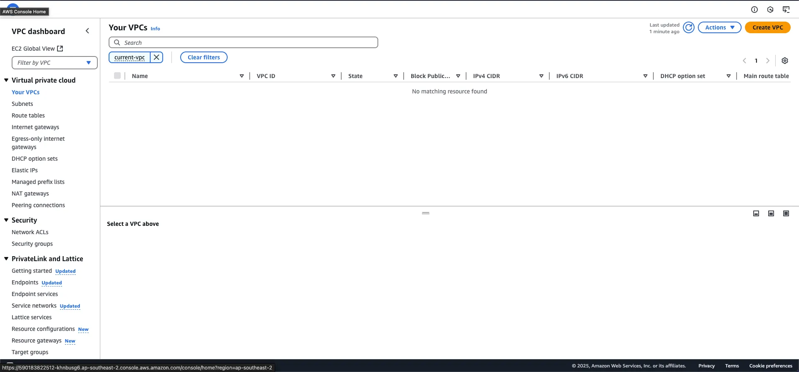
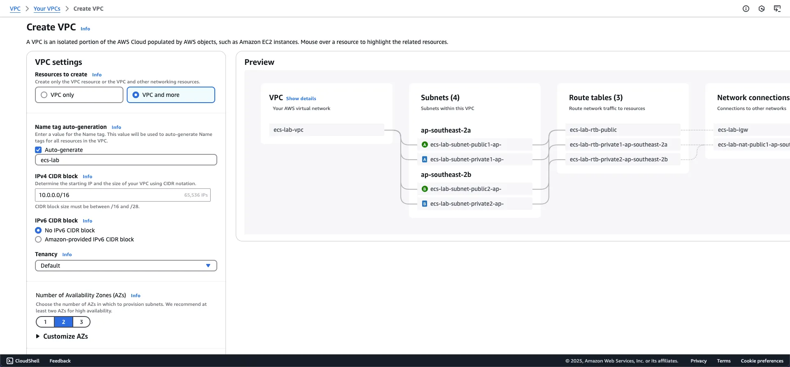
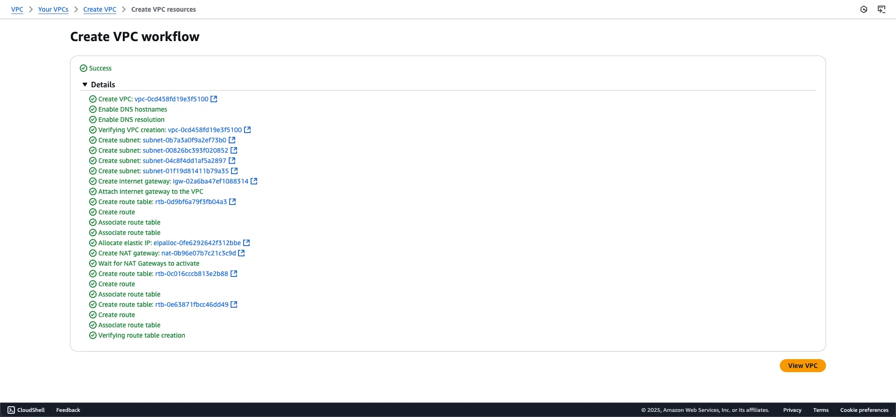
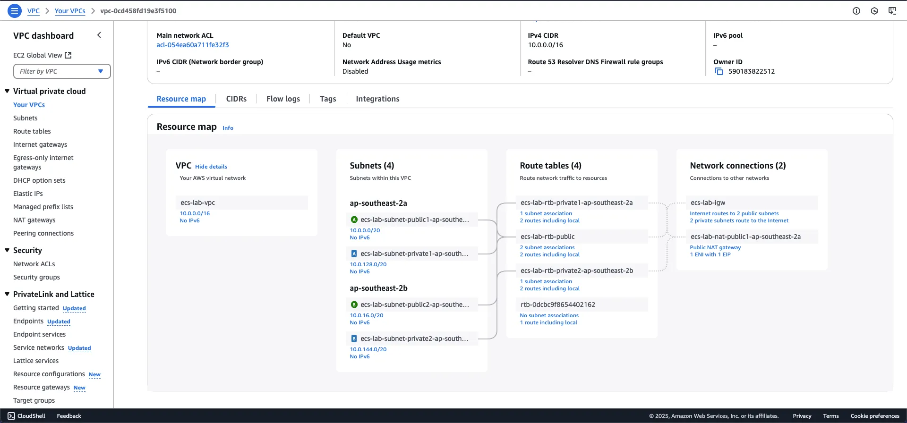

<!-- TODO: Thêm hình ảnh Architect VPC -->

### Giới thiệu

Amazon Virtual Private Cloud (Amazon VPC) là dịch vụ cho phép bạn khởi tạo một môi trường mạng riêng ảo được cô lập hoàn toàn trên AWS Cloud. Trong môi trường này, bạn có thể triển khai và quản lý các tài nguyên AWS một cách linh hoạt theo nhu cầu của tổ chức.

Trong phần này, chúng ta sẽ tìm hiểu cách thiết lập các thành phần mạng cơ bản sau:

1. Virtual Private Cloud (VPC)
2. Subnets (Public và Private)
3. Internet Gateway
4. Network Address Translation (NAT) Gateway  
5. Route Tables

### Khởi tạo VPC

#### Bước 1: Truy cập VPC Dashboard

1. Đăng nhập vào AWS Management Console
2. Truy cập [VPC Dashboard](http://console.aws.amazon.com/vpc/home)
3. Chọn **Create VPC**

#### Bước 2: Cấu hình VPC

Trong giao diện Create VPC:

1. Chọn **VPC and More**
2. Cấu hình các thông số:
   - Name tag: Đặt tên cho VPC
   - IPv4 CIDR block: `10.0.0.0/16`
   - Availability Zones: Chọn 2 AZs để đảm bảo tính sẵn sàng cao
   - Subnets: 2 Public Subnets và 2 Private Subnets
   - NAT Gateway: Tạo trong 1 AZ
   - VPC endpoints: Không tạo S3 Gateway

{}
Sử dụng Preview Map để xác nhận cấu trúc mạng phù hợp với yêu cầu của bạn.
{}

#### Bước 3: Xác nhận và tạo VPC

AWS sẽ tự động khởi tạo tuần tự các thành phần mạng theo cấu hình đã chọn.

Sau khi hoàn tất, bạn có thể xem chi tiết cấu hình VPC:

### Tổng kết

Trong phần này, bạn đã hoàn thành việc thiết lập cơ sở hạ tầng mạng cơ bản trên AWS Cloud. Đây là bước quan trọng và cần thiết trước khi triển khai bất kỳ dịch vụ AWS nào. Cấu trúc mạng này sẽ đảm bảo tính bảo mật và hiệu quả cho các ứng dụng của bạn.