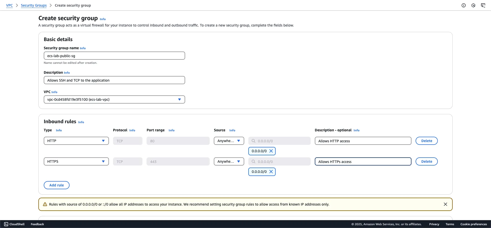
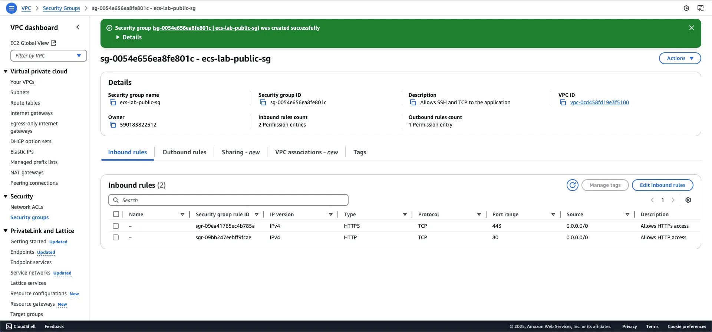
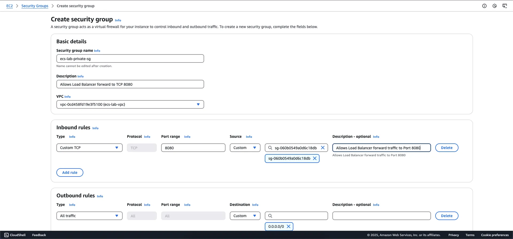
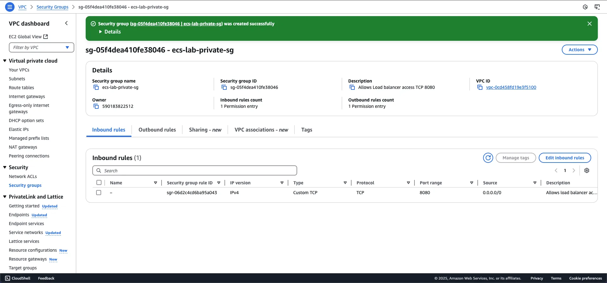

<!-- TODO: Thêm hình ảnh Architect Security Group -->
### Giới thiệu

Security Group (SG) là một tường lửa ảo bảo vệ các tài nguyên AWS khỏi các truy cập trái phép. Security Group kiểm soát lưu lượng mạng đến (inbound) và đi ra (outbound) cho các tài nguyên thông qua việc định nghĩa các quy tắc (rules).

### Các thành phần chính của Security Group

#### 1. Inbound Rules (Quy tắc lưu lượng đến)
- Kiểm soát lưu lượng được phép truy cập vào Network Interface (ENI)
- Bao gồm các thành phần:
  - Source: Địa chỉ IP hoặc ID của Security Group nguồn
  - Protocol: Giao thức mạng được cho phép (TCP, UDP, ICMP,...)
  - Port Range: Dải cổng được phép truy cập

{}
Mặc định, Security Group sử dụng cơ chế whitelisting - từ chối tất cả lưu lượng truy cập cho đến khi được cấp quyền rõ ràng thông qua inbound rules.
{}

#### 2. Outbound Rules (Quy tắc lưu lượng đi)
- Kiểm soát lưu lượng đi ra từ tài nguyên
- Bao gồm:
  - Destination: Địa chỉ IP đích hoặc ID Security Group đích
  - Protocol: Giao thức mạng được cho phép
  - Port Range: Dải cổng đích được phép kết nối

{}
Mặc định, Security Group cho phép tất cả lưu lượng đi ra (outbound). Nếu xóa rule này, tài nguyên sẽ không thể kết nối ra Internet.
{}

#### 3. Tính năng Stateful
Security Group hoạt động theo cơ chế stateful - khi một request được cho phép đi vào, phản hồi của request đó sẽ tự động được cho phép đi ra mà không cần định nghĩa trong outbound rules.

### Thực hành: Khởi tạo Security Group

Chúng ta sẽ khởi tạo 3 Security Group cho kiến trúc của mình:

#### 1. Public Security Group
**Mục đích**: Bảo vệ Application Load Balancer (ALB)

**Các bước thực hiện**:
1. Truy cập [Security Group Dashboard](console.aws.amazon.com/ec2/home#SecurityGroups)
2. Chọn Create Security Group
3. Cấu hình:
   - Tên: Public SG
   - VPC: ecs-lab-vpc
   - Inbound Rules:
     - Port 80 (HTTP)
     - Port 443 (HTTPS)
   - Outbound Rules: Cho phép tất cả lưu lượng
4. Thêm tags (tùy chọn)
5. Chọn Create Security Group

#### 2. Private Security Group 
**Mục đích**: Bảo vệ Amazon Fargate tasks trong Private Subnet

**Các bước thực hiện**:
1. Tạo Security Group mới
2. Cấu hình:
   - Tên: Private SG
   - VPC: ecs-lab-vpc
   - Inbound Rules: 
     - Port 8080 (TCP) từ Public Security Group
   - Outbound Rules: Cho phép tất cả lưu lượng

{}
Security Best Practices: Chỉ cho phép Inbound Rule TCP 8080 từ Public SG để đảm bảo chỉ ALB mới có thể truy cập các instance trong Private Subnet.
{}

#### 3. UI Security Group
**Mục đích**: Bảo vệ Fargate tasks cho UI Service

**Cấu hình**:
- Tên: UI-SG
- VPC: ecs-lab-vpc
- Inbound Rules:
  - Port 8080 (TCP) từ Public Security Group
- Outbound Rules: Cho phép tất cả lưu lượng

<!-- TODO: Thêm Hình ảnh UI SG -->