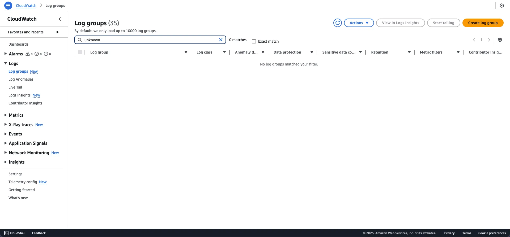
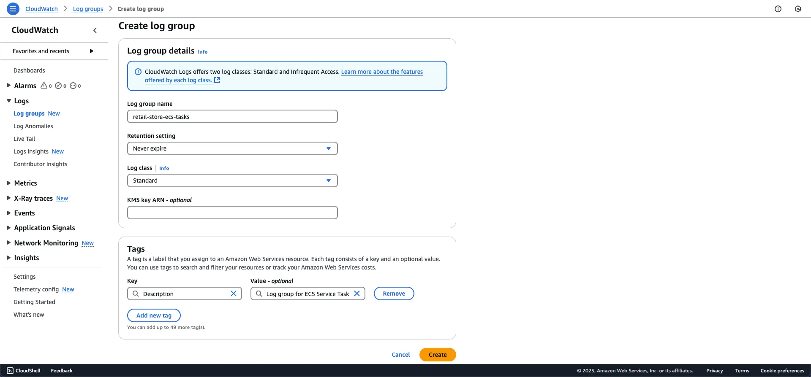
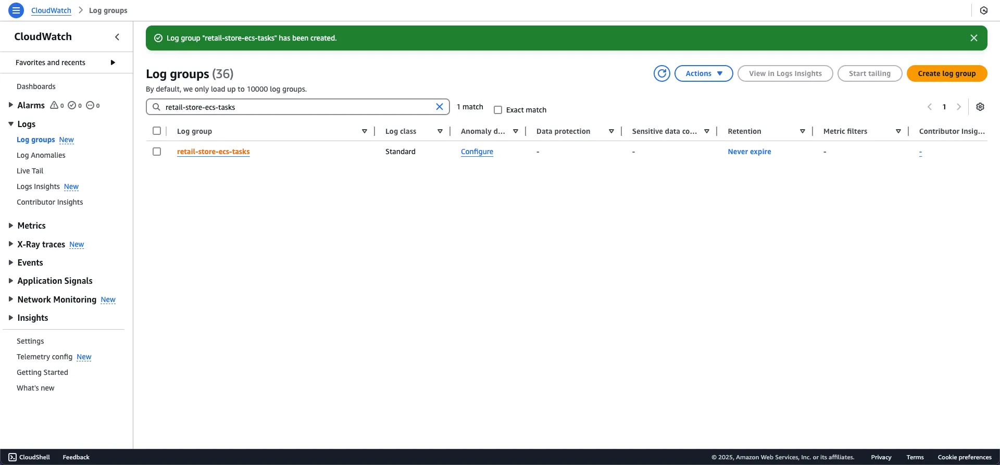

<!-- TODO: Thêm hình arch -->
### CloudWatch là gì

Amazon CloudWatch là dịch vụ giám sát và quan sát toàn diện được xây dựng cho các nhà phát triển, kỹ sư vận hành, quản trị viên site reliability engineer (SRE) và quản trị viên IT. CloudWatch cung cấp dữ liệu và góc nhìn có thể thực thi để giám sát các ứng dụng, phản hồi các thay đổi hiệu suất trên toàn hệ thống, tối ưu hóa việc sử dụng tài nguyên và có cái nhìn thống nhất về tình trạng hoạt động. CloudWatch thu thập dữ liệu vận hành và giám sát dưới dạng logs, metrics và events, cung cấp cái nhìn thống nhất về các tài nguyên, ứng dụng và dịch vụ AWS đang chạy trên AWS và cơ sở hạ tầng tại chỗ.

### Tình huống sử dụng

Trong bài thực hành này, chúng ta sẽ tìm hiểu cách sử dụng Amazon CloudWatch để giám sát các chỉ số (metrics), nhật ký (logs) và vết (traces) trong Amazon ECS Services.

### Khởi tạo Log Group

1. Truy cập vào giao diện Amazon CloudWatch trên AWS Management Console

2. Điều hướng đến CloudWatch Logs Group và chọn Create Log Group

3. Nhập thông tin cấu hình:
- Tên Log Group: `retail-store-ecs-tasks`  
- Thêm tag (tùy chọn)
- Chọn Create để tạo Log Group

{}
Lưu ý: Tên Log Group `retail-store-ecs-tasks` sẽ được sử dụng xuyên suốt trong các lệnh CLI của bài thực hành này!
{}

4. Xác nhận Log Group đã được tạo thành công

