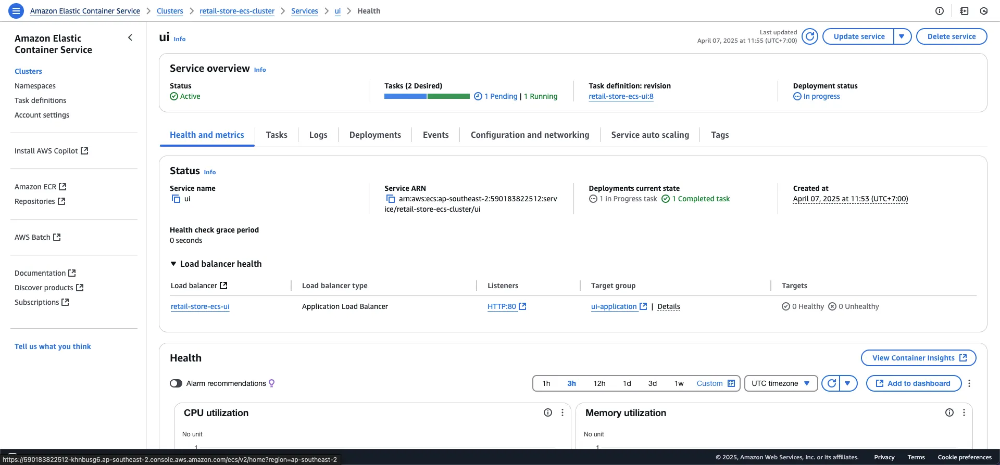
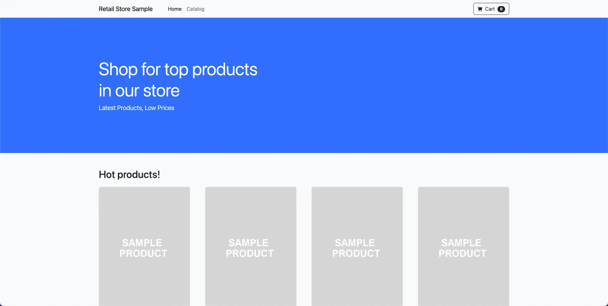
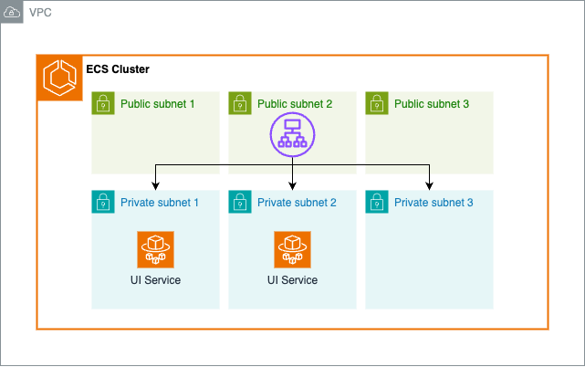

### Amazon ECS Services

Amazon ECS Services cho phép bạn chạy và duy trì một số lượng task definition cụ thể trong Amazon ECS cluster. Khi task gặp sự cố hoặc dừng hoạt động, ECS service scheduler sẽ tự động khởi chạy task mới để thay thế, đảm bảo duy trì số lượng task mong muốn và tính sẵn sàng cao cho ứng dụng.

---
### Tổng quan

ECS Services thường được sử dụng để:
- Quản lý các ứng dụng chạy lâu dài
- Triển khai microservices 
- Vận hành các thành phần phần mềm yêu cầu tính sẵn sàng cao

Services có thể tích hợp với Elastic Load Balancing (ELB) để phân phối lưu lượng đồng đều giữa các task, giúp triển khai, quản lý và mở rộng ứng dụng container một cách linh hoạt.

#### Thiết lập môi trường

Trước khi tạo service, cần thiết lập các biến môi trường:

1. Lấy Private Subnet ID từ [ecs-lab-vpc](console.aws.amazon.com/vpcconsole/home#vpcs:search=ecs-lab-vpc)
2. Lấy Security Group ID từ [UI-SG-ID](console.aws.amazon.com/vpcconsole/home#SecurityGroups:v=3;search=:ecs-lab-ui-sg)

```bash
# Ví dụ:
export PRIVATE_SUBNET1=subnet-04c8f4dd1af5a2897
export PRIVATE_SUBNET2=subnet-01f19d81411b79a35
export UI_SG_ID=sg-060b0549a0d6c18db
```

#### Tạo ECS Service

Thực hiện các lệnh sau để tạo service:

```bash
export UI_TARGET_GROUP_ARN=$(aws elbv2 describe-target-groups --names ui-application \
 --query 'TargetGroups[0].TargetGroupArn' --output text)

aws ecs create-service \
 --cluster retail-store-ecs-cluster \
 --service-name ui \
 --task-definition retail-store-ecs-ui \
 --desired-count 2 \
 --launch-type FARGATE \
 --load-balancers targetGroupArn=${UI_TARGET_GROUP_ARN},containerName=application,containerPort=8080 \
 --network-configuration "awsvpcConfiguration={subnets=[${PRIVATE_SUBNET1},${PRIVATE_SUBNET2}],securityGroups=[${UI_SG_ID}],assignPublicIp=DISABLED}"
```

#### Kiểm tra trạng thái Service

Theo dõi trạng thái service qua [Amazon ECS Console](https://console.aws.amazon.com/ecs/v2/clusters/retail-store-ecs-cluster/services/ui)



Hoặc đợi service ổn định bằng AWS CLI:

```bash
aws ecs wait services-stable --cluster retail-store-ecs-cluster --services ui
```

Xem danh sách task đang chạy:

```bash
aws ecs describe-tasks \
    --cluster retail-store-ecs-cluster \
    --tasks $(aws ecs list-tasks --cluster retail-store-ecs-cluster --query 'taskArns[]' --output text) \
    --query "tasks[*].[group, launchType, lastStatus, healthStatus, taskArn]" --output table
```

#### Truy cập ứng dụng

Lấy URL của load balancer:

```bash
export RETAIL_ALB=$(aws elbv2 describe-load-balancers --name retail-store-ecs-ui \
 --query 'LoadBalancers[0].DNSName' --output text)

echo http://${RETAIL_ALB}
```

Truy cập URL trong trình duyệt để xem ứng dụng:



---
### Kiến trúc hiện tại

Sau khi hoàn tất các bước trên, kiến trúc dịch vụ sẽ như sau:

