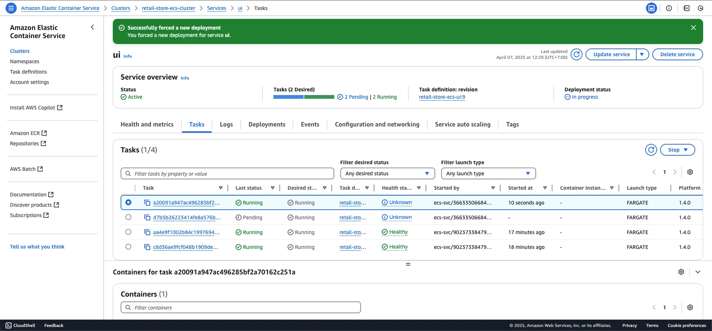
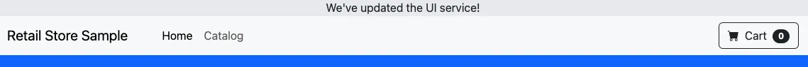

### Cập nhật một Service

Trong phần này, bạn sẽ tìm hiểu cách cập nhật một ECS service. Quy trình này rất hữu ích trong các tình huống như thay đổi container image hoặc điều chỉnh cấu hình.

---
### Giới thiệu về Environment Variables

Environment variables là một trong những cơ chế chính được sử dụng để cấu hình container workloads, không phụ thuộc vào orchestrator. Trong bài thực hành này, bạn sẽ điều chỉnh cấu hình của UI service bằng cách truyền một environment variable mới để thay đổi hành vi của workload. Cụ thể, bạn sẽ sử dụng thiết lập `RETAIL_UI_BANNER` để thêm một banner vào trang.

Trong ECS task definitions, environment variables được khai báo với name và value như sau:

```json
"environment": [
    {
        "name": "RETAIL_UI_BANNER", 
        "value": "We've updated the UI service!"
    }
]
```

#### Cập nhật Task Definition với Environment Variable

Tạo file task definition mới với environment variable:

```bash
cat << EOF > retail-store-ecs-ui-updated-taskdef.json
{
    "family": "retail-store-ecs-ui",
    "executionRoleArn": "arn:aws:iam::${ACCOUNT_ID}:role/retailStoreEcsTaskExecutionRole",
    "taskRoleArn": "arn:aws:iam::${ACCOUNT_ID}:role/retailStoreEcsTaskRole",
    "networkMode": "awsvpc",
    "requiresCompatibilities": [
        "FARGATE"
    ],
    "cpu": "1024",
    "memory": "2048",
    "runtimePlatform": {
        "cpuArchitecture": "X86_64",
        "operatingSystemFamily": "LINUX"
    },
    "containerDefinitions": [
        {
            "name": "application",
            "image": "public.ecr.aws/aws-containers/retail-store-sample-ui:0.7.0",
            "portMappings": [
                {
                    "name": "application", 
                    "containerPort": 8080,
                    "hostPort": 8080,
                    "protocol": "tcp",
                    "appProtocol": "http"
                }
            ],
            "essential": true,
            "linuxParameters": {
                "initProcessEnabled": true
            },
            # --- New Environment ---
            "environment": [
                {
                    "name": "RETAIL_UI_BANNER",
                    "value": "We've updated the UI service!"
                }
            ],
            "healthCheck": {
                "command": [
                    "CMD-SHELL",
                    "curl -f http://localhost:8080/actuator/health || exit 1"
                ],
                "interval": 10,
                "timeout": 5,
                "retries": 3,
                "startPeriod": 60
            },
            "logConfiguration": {
                "logDriver": "awslogs",
                "options": {
                    "awslogs-group": "retail-store-ecs-tasks",
                    "awslogs-region": "$AWS_REGION",
                    "awslogs-stream-prefix": "ui-service"
                }
            }
        }
    ]
}
EOF
```

#### Đăng ký Task Definition Mới

Sử dụng lệnh `register-task-definition` để cập nhật task definition:

```bash
aws ecs register-task-definition --cli-input-json file://retail-store-ecs-ui-updated-taskdef.json
```

{}
**Lưu ý quan trọng**: ECS task definitions là immutable, nghĩa là không thể sửa đổi sau khi tạo. Thay vào đó, lệnh trên sẽ tạo một phiên bản mới của task definition với các tham số mới thay thế các tham số hiện có.
{}

Kiểm tra các phiên bản task definition:

```bash
aws ecs list-task-definitions --family-prefix retail-store-ecs-ui
```

Kết quả sẽ hiển thị tất cả các phiên bản của UI task definition family:

```json
{
    "taskDefinitionArns": [
        "arn:aws:ecs:us-west-2:XXXXXXXXXXXX:task-definition/retail-store-ecs-ui:1",
        "arn:aws:ecs:us-west-2:XXXXXXXXXXXX:task-definition/retail-store-ecs-ui:2"
    ]
}
```

#### Cập nhật Service

Cập nhật ECS service để sử dụng phiên bản task definition mới:

```bash
aws ecs update-service --cluster retail-store-ecs-cluster --service ui --task-definition retail-store-ecs-ui
```

Đợi ECS triển khai các thay đổi (khoảng 5 phút):

```bash
aws ecs wait services-stable --cluster retail-store-ecs-cluster --services ui
```



Làm mới trình duyệt của bạn, bạn sẽ thấy banner đã được thêm vào dựa trên environment variables:



{}
**Mẹo**: Bạn có thể cần cuộn lên để xem banner.
{}
