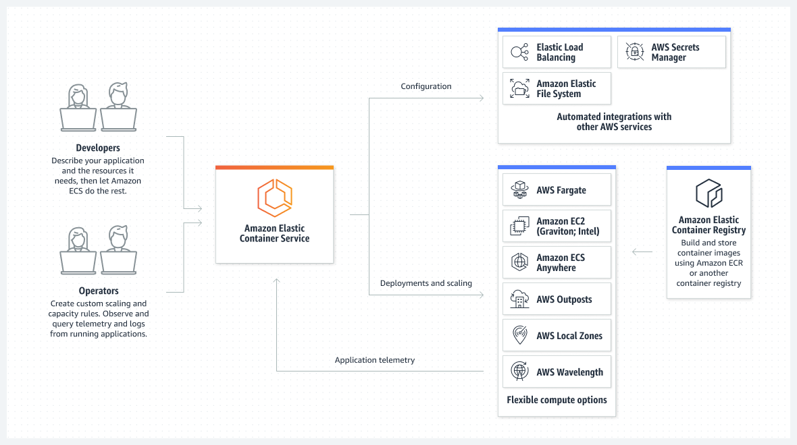

# Series of Amazon Elastic Container Services

Welcome to the Series of Amazon Elastic Container Service!

This series includes **7 workshops** will guide you through comprehensive hands-on on Amazon Elastic Container Services.

**Amazon Elastic Container Service (ECS)** is a fully managed container orchestration service that enables you to deploy, manage, and scale containerized applications more efficiently. It seamlessly integrates with the AWS ecosystem to provide an easy-to-use solution for running container workloads in the cloud and on-premises, featuring advanced security capabilities through Amazon ECS Anywhere.

**AWS Fargate** is a serverless, pay-as-you-go compute engine that allows you to focus on building applications without the burden of managing servers. By offloading tasks such as server management, resource allocation, and scaling to AWS, you can not only enhance your operational posture but also accelerate the journey from idea to production in the cloud while reducing total cost of ownership.

#### What will I learn?
This workshop offers a modular experience to explore a wide range of topics related to Amazon ECS, including:

1. Understanding the fundamentals of **Amazon ECS and Fargate**, such as clusters, tasks, and services
2. **Implementing autoscaling** for your workloads to accommodate varying loads
3. **Monitoring workload** behavior through logs, metrics, and traces
4. Gaining insights into AWS Fargate networking and **advanced networking concepts**
5. Exploring various **security aspects**, including secure credential and secret management
6. **Automating workload deployments** to Amazon ECS using CI/CD pipelines

#### Target audience

This **200+ level** workshop is designed for software engineers, platform engineers, and IT professionals who want to gain hands-on experience with Amazon ECS. It's ideal for those looking to familiarize themselves with the core components and key features of Amazon ECS, as well as its practical application in deploying and managing containerized workloads.

#### Pre-requisites
This workshop is not intended as an introductory session on containers. Participants are expected to have a foundational understanding of relevant container concepts. The following topics are considered pre-requisites for fully comprehending the material:

1. [Understanding of containers](https://www.docker.com/resources/what-container/), including the ability to build containers using a Dockerfile
2. General familiarity with the AWS console and/or AWS APIs
3. Experience with VSCode (familiarity with any IDE should be sufficient)

#### Main concepts

1. [Getting started](1-getting-started/)
2. [Prerequisites](2-prerequisites/)
3. [Fundamentals](3-fundamentals/)
4. [Clean resources](4-clean-resources/)