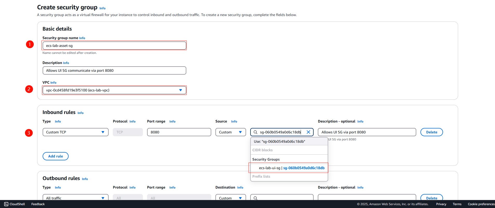
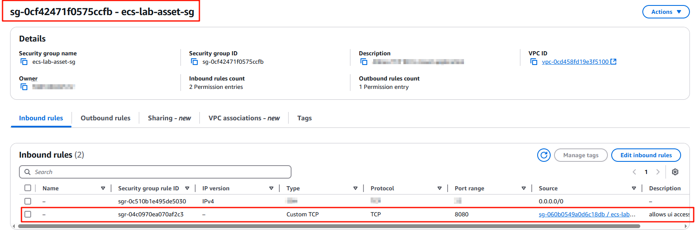
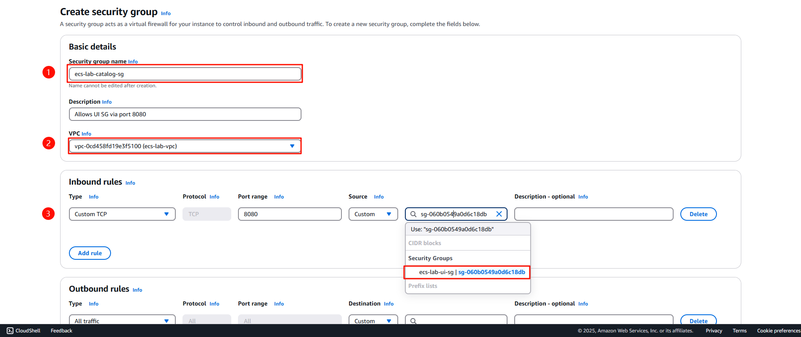
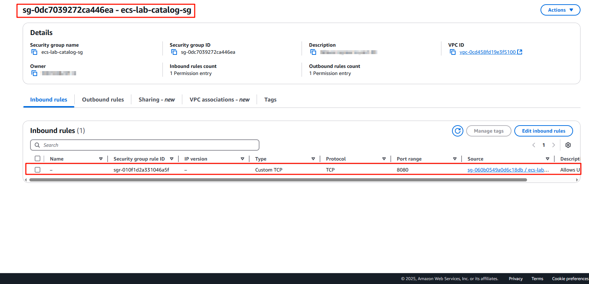

<!-- 1. Asset SG, Catalog SG-->

Section này chúng ta sẽ tạo Security Group cho services Assets và Catalog, mục đích cho phép UI Security Group giao tiếp với các services trên.

#### Tạo Assets Security Group

Truy cập [Security Group](console.aws.amazon.com/ec2/home?SecurityGroups:) > Create security group

- Tạo security với tên `ecs-lab-asset-sg`
- VPC `ecs-lab-vpc`
- Inbound rules: Port TCP 8080 - `ecs-lab-ui-sg`
- Allows all outbound rules

*Figure 1. Giao diện tạo Assets Security Group*

*Figure 2. Tạo thành công Assets SG*

---

#### Tạo Catalog Security Group

Truy cập [Security Group](console.aws.amazon.com/ec2/home?SecurityGroups:) > Create security group

- Tạo security với tên `ecs-lab-catalog-sg`
- VPC `ecs-lab-vpc`
- Inbound rules: Port TCP 8080 - `ecs-lab-ui-sg`
- Allows all outbound rules

*Figure 3. Giao diện tạo Catalog Security Group*

*Figure 2. Tạo thành công Catalog SG*

✅ Chúc mừng chúng ta đã tạo thành công Security Group cho service Assets và Catalog

