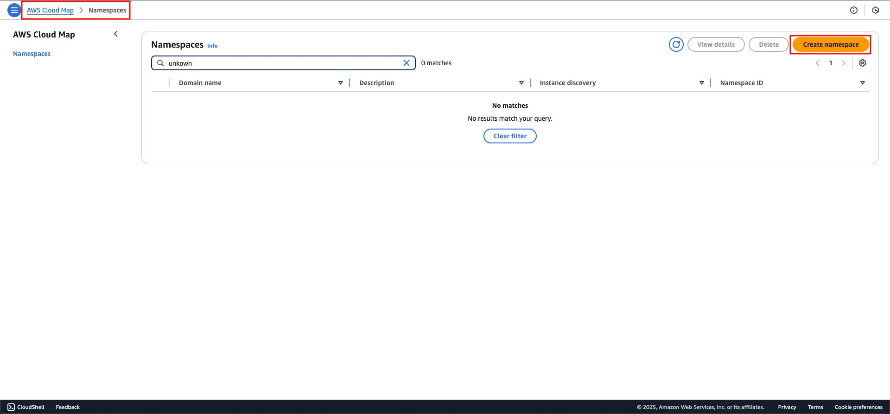
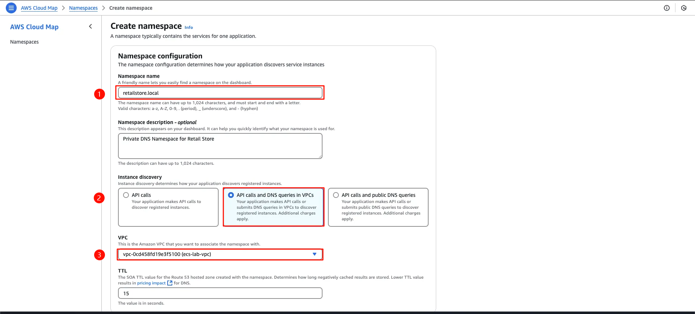
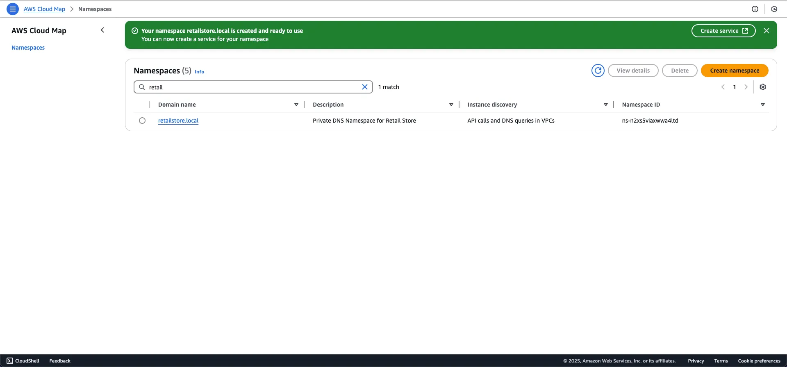

<!-- 2. Cloud Map - Create a Service Discovery Namespace -->

[Cloud map icon](/images/3-service-connect/image.png)
*Figure 1. Cloud map Icon*

### Cloud Map là gì ?

AWS Cloud Map is a fully managed solution that you can use to map logical names to the backend services and resources that your applications depend on.

### Thành phần của Cloud Map

#### Namespace

A namespace identifies the name that you want to use to locate your resources and also specifies how you want to locate resources

#### Service

After creating a namespace, you create an AWS Cloud Map service for each type of resource for which you want to use AWS Cloud Map to locate endpoints.
For example, you might create services for web servers and database servers.

#### Service Instance

When your application adds a resource, you can call the AWS Cloud Map RegisterInstance API action in the code, which creates a AWS Cloud Map service instance in a service.

<!-- TODO: Refer: https://docs.aws.amazon.com/cloud-map/latest/dg/what-is-cloud-map.html -->

### Use case trong bài lab

Dựa trên lý thuyết, trong bài lab này, chúng ta sẽ sử dụng cloud map để map logical names của ui service, catalog service, assets service. Điều này thể hiện khả năng service discovery của Cloud Map.

---

#### Tạo Service Discovery Namespace

Truy cập [Giao diện Cloud Map Namespaces](https://console.aws.amazon.com/cloudmap/home/namespaces) > Create Namespace

*Figure 2. Giao diện Cloud Map Namespaces*

Trong giao diện Create namespace,
- Namespace name `retailstore.local`
- Instance discovery `API calls and DNS Queries in VPCs`
- VPC: `ecs-lab-vpc`

*Figure 3. Giao diện Create namespace*

Tạo thành công Namespace:

*Figure 4. Tạo thành công namespace*

✅ Chúng ta đã hoàn thành tạo Cloud Map namespace
