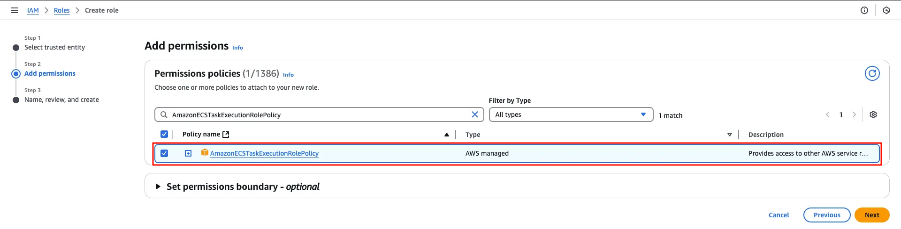
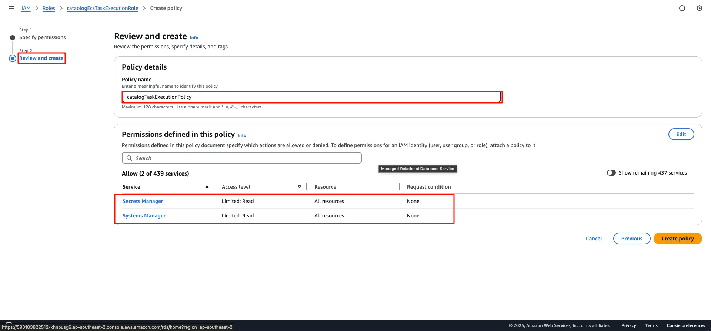

<!-- 3. cataologEcsTaskExecutionRole  -->
Trong section này, chúng ta sẽ tiến hành tạo Catalog Task Execution Role, mục đích gán cho Catalog service giúp Catalog gọi các AWS services thay bạn.

#### Tạo Catalog Task Execution Role

Truy cập [IAM Role Dashboard](https://console.aws.amazon.com/iam/home/roles) > Create Role

Trong giao diện Select trusted entity:
- Chọn AWS Service
- Elastic Container Service use case
- Elastic Container Service Task


*Figure 1. Giao diện Select trusted entity*

Tại Add Permission, gán policy `AmazonECSTaskExecutionRolePolicy` > Next


*Figure 2. Giao diện Add Permission*

Khi tạo thành công, truy cập detail role, tại **Permission* tab chọn dropdown > Create Inline Policy


*Figure 3. Detail Catalog Role*

Truy cập Policy Editor > tab JSON

```json
{
	"Version": "2012-10-17",
	"Statement": [
		{
			"Effect": "Allow",
            "Action": [
                "ssm:GetParameters",
                "secretsmanager:GetSecretValue"
            ],
            "Resource": "*"
		}
	]
}
```

Thêm policy này vào thông qua Policy Editor


*Figure 4. Thêm inline policy*

Tại bước Review and Create, đặt tên policy name `catalogTaskExecutionPolicy`


*Figure 5. Review and Create step*

Thêm Inline policy thành công:


*Figure 6. Thêm inline policy thành công*