<!-- 4. Create DB Subnet & Security group & Create MySQL AuroraDB -->

Trong section này chúng ta sẽ tiến hành tạo Amazon Aurora Mysql Database, mục đích catalog sẽ sử dụng Database này để lưu trữ catalogs.

#### Tạo Database Subnet Group

Truy cập [RDS Subnet Group](https://console.aws.amazon.com/rds/home?db-subnet-groups-list:) > Create DB Subnet Group

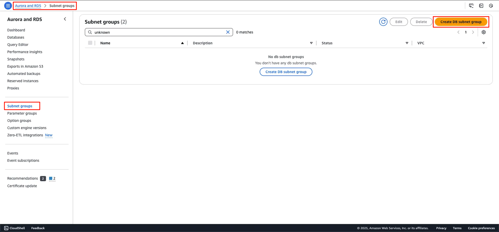
Figure 1.

Trong giao diện Create DB Subnet Group
- Name `ecs-lab-subnet-group-db`
- VPC `ecs-lab-vpc`
- AZs `ap-southeast-2a` & `ap-southeast-2b`
- Subnets `ecs-lab-subnet-private1-ap-southeast-2a` & `ecs-lab-subnet-private1-ap-southeast-2b`

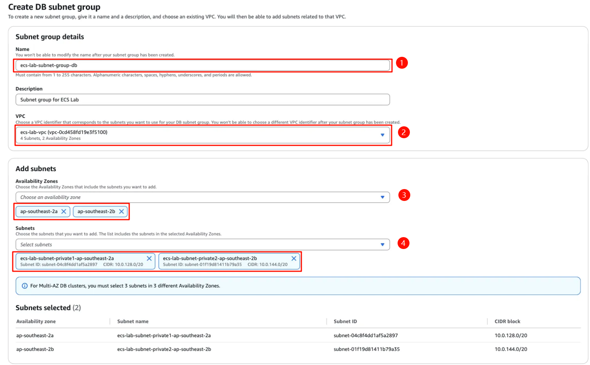
Figure 2.

Giao diện tạo thành công Subnet group:

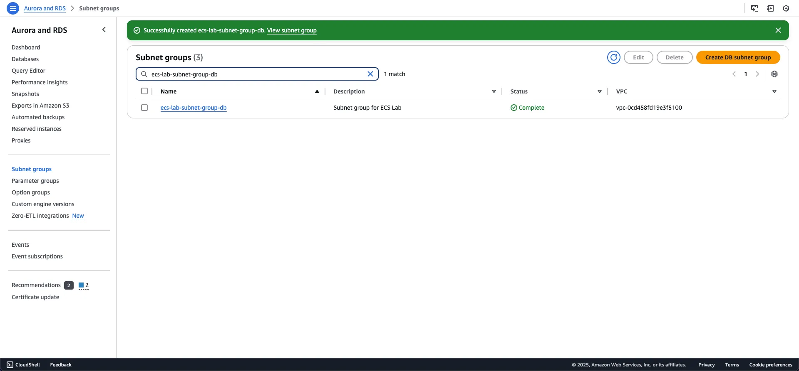
Figure 3.

---

#### Tạo Database Security Group

Truy cập [Security Group dashboard](https://console.aws.amazon.com/vpcconsole/home#SecurityGroups:v=3)

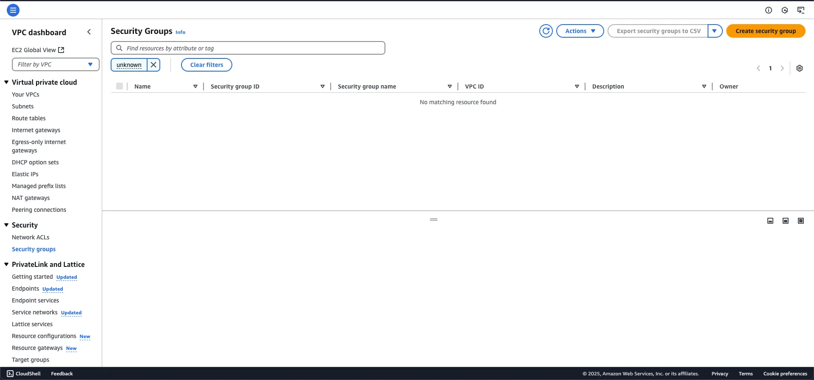
Figure 4.

Trong giao diện tạo SG:
- security group name `ecs-lab-db-sg`
- vpc `ecs-lab-vpc`
- Inbound TCP 3306 - `ecs-lab-catalog-sg`

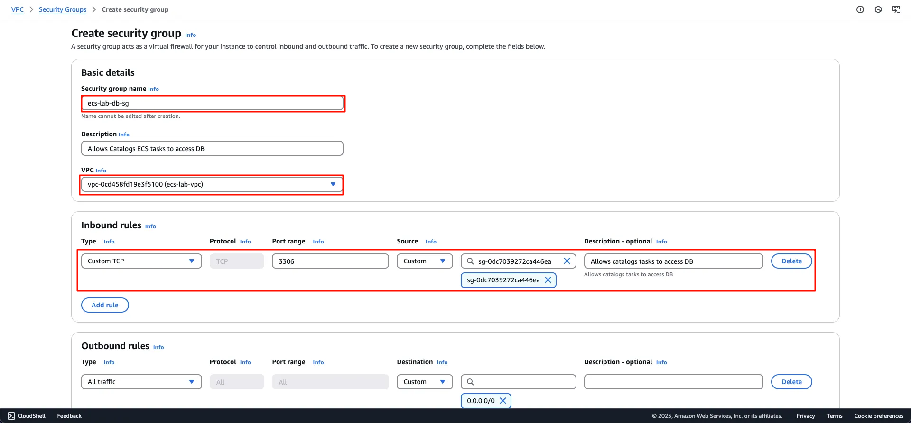
Figure 5.

Tạo thành công Security Group
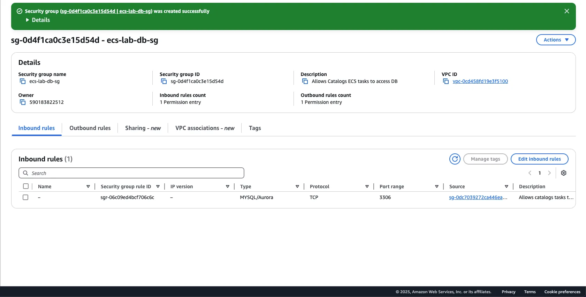
Figure 6.

---
#### Tạo Amazon Aurora Mysql Database

Truy cập [RDS Dashboard](https://console.aws.amazon.com/rds/home2)

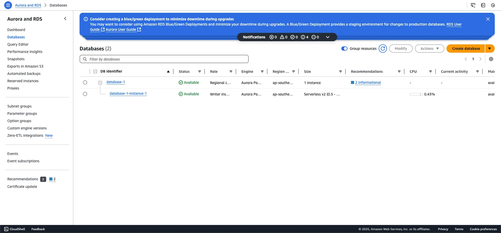
Figure 7.

Trong giao diện Create Database
- Chọn Standard Create
- Engine `Aurora (MySQL Compatible)`

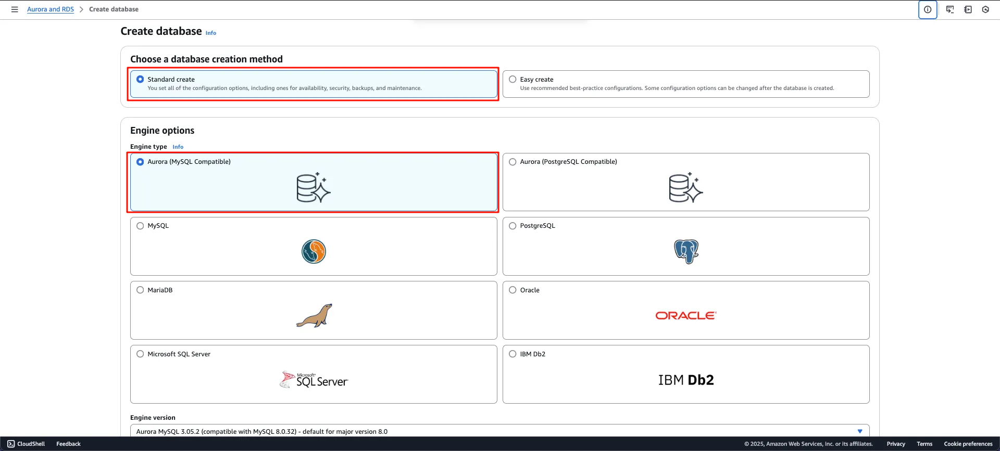
Figure 8.

Cuộn xuống,
- Template `Dev/Test`
- Đặt DB Cluster name
- Master username `admin` & password `admin123`

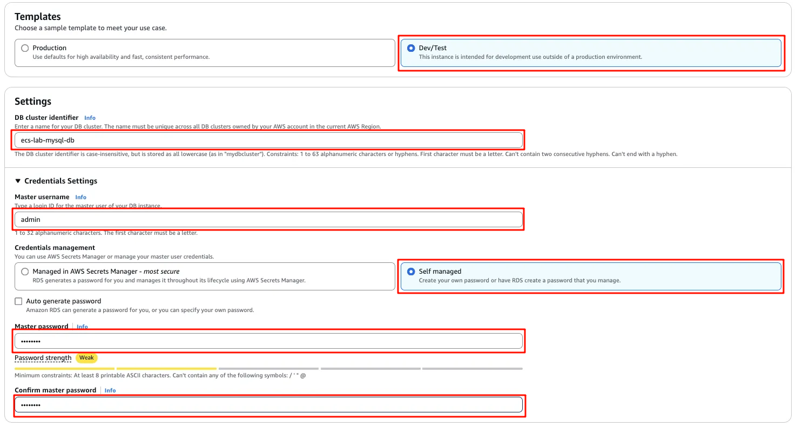
Figure 9.

Cuộn xuống, tại Connectivity
- Chọn vpc `ecs-lab-vpc`
- Subnet group `ecs-lab-subnet-group-db`
- Security group `ecs-lab-db-sg`
- Avalability Zone `ap-southeast-2a`

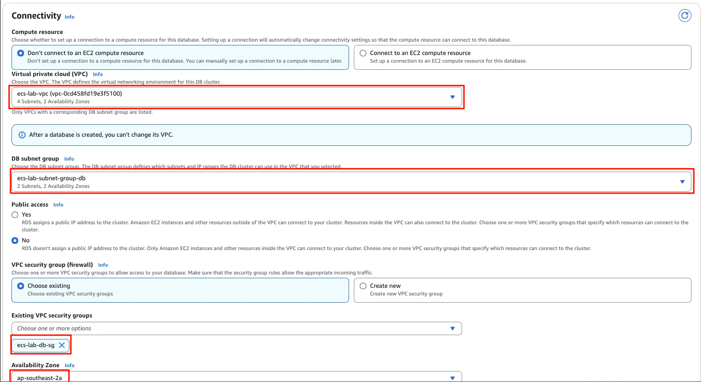
Figure 10.

Cuộn xuống cuối cùng, tại Drop Down Additional Configuration:
- Tạo inital database name `catalog`
- Giữ nguyên phần còn lại

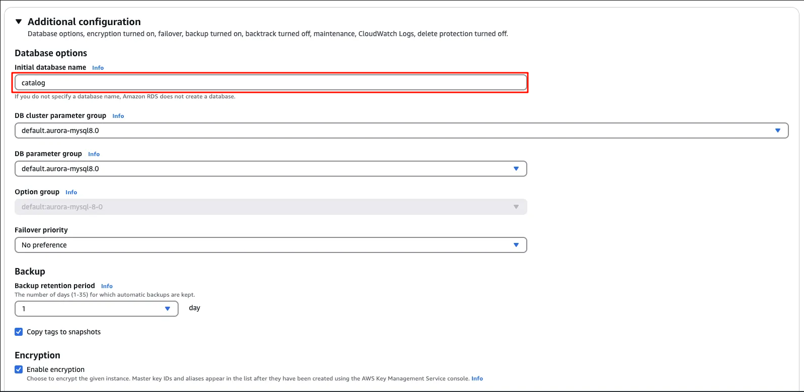
Figure 11.

✅ Xong section này, chúng ta đã tạo thành công Aurora Mysql Database

