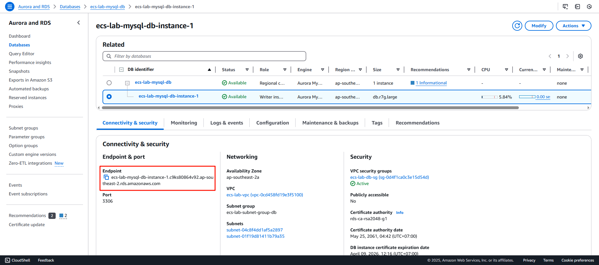
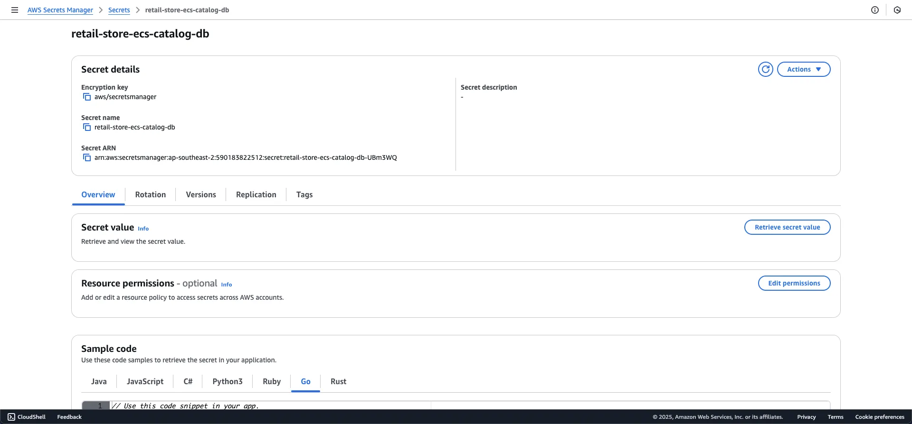

<!-- 5. Create secret manager -->

AWS Systems Manager
Quản lý nút ở quy mô lớn trên AWS cũng như trong các môi trường kết hợp và môi trường đa đám mây

Secret manager
Trình quản lý thông tin bí mật của AWS cho phép bạn quản lý, truy xuất và xoay vòng thông tin chứng thực cơ sở dữ liệu, khóa API và các bí mật khác trong suốt vòng đời của chúng.

---
#### Tạo Database Endpoint node

Sau khi tạo thành công database, bạn truy cập detail db instance, copy endpoint


Figure 1.

```bash
# change your value
aws ssm put-parameter \
  --name "/retail-store-ecs/catalog/db-endpoint" \
  --value "<your-mysql-url>:3306" \
  --type "String" \
  --overwrite
  
aws ssm get-parameter --name "/retail-store-ecs/catalog/db-endpoint"
```

#### Tạo secret values

{}
Lưu ý: thay thế username & password nếu bạn đặt giá trị khác khi tạo database.
{}

```bash
aws secretsmanager create-secret \
  --name "retail-store-ecs-catalog-db" \
  --secret-string '{"username":"admin","password":"admin123"}'
  
aws secretsmanager get-secret-value --secret-id "retail-store-ecs-catalog-db"
```


Figure 2. Tạo thành công value trong secret manager
