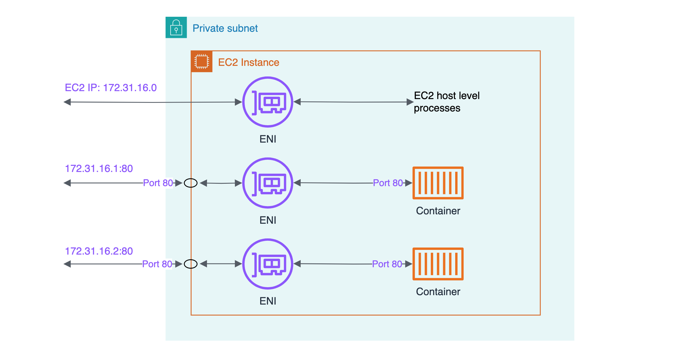
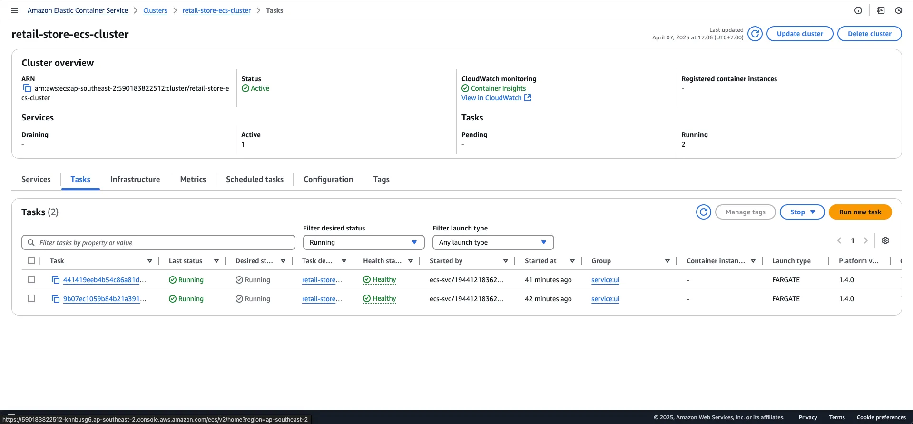
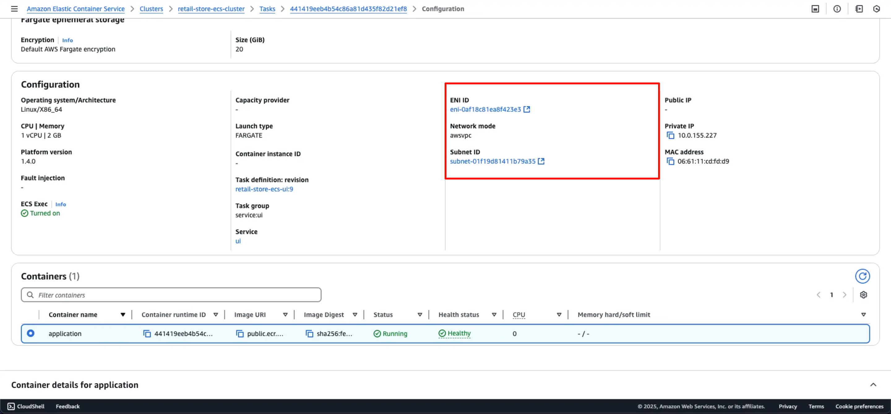

{}
You must have completed the following chapters as pre-requisites for this lab: [Fundamentals](https://aws-fcj-ecs-workshop.github.io/Amazon-ECS-Immersion-Day/fundamentals/)
{}

When running containers, it's crucial to consider the network configurations of containers running on the host. [Review the documentation for more information on how to choose a network mode](https://docs.aws.amazon.com/AmazonECS/latest/developerguide/task-networking.html) . In this section, we will provide an overview of the **AWSVPC mode** network configuration required for Amazon ECS on Fargate.

In **AWSVPC mode**, Amazon ECS creates and manages an Elastic Network Interface (ENI) for each task, and each task receives its own private IP address within the VPC. This configuration provides great flexibility to control communications between tasks and services at a more granular level. The AWSVPC network mode is supported for Amazon ECS tasks hosted on both Amazon EC2 and Fargate. [For more information, click here](https://docs.aws.amazon.com/AmazonECS/latest/developerguide/task-networking-awsvpc.html) .


{}
When using Amazon ECS on Fargate, the AWSVPC network mode is required.
{}



In this section, we will review the Amazon ECS network configuration.

#### Review the Network Mode on the deployed Amazon ECS Cluster

Open the Amazon ECS console to inspect the services.

[Open Amazon ECS console](https://console.aws.amazon.com/ecs/v2/clusters/retail-store-ecs-cluster/tasks)



From here, you can select the first running task. Scroll to the **Configuration** section to review the 
**Network mode**, the **ENI ID**, and the **Private IP** attached to the task:




You can access the task information programmatically by executing the following command to get the information of the task running in the `ui` service:

```bash
    aws ecs describe-tasks \
     --cluster retail-store-ecs-cluster \
     --tasks $(aws ecs list-tasks --cluster retail-store-ecs-cluster --service ui --query 'taskArns[0]' --output text)
```

Output:

```json
   {
    "tasks": [
        {
            "attachments": [
                {
                    "id": "464044b3-626f-44da-86ec-fa20a064d408",
                    "type": "ElasticNetworkInterface",
                    "status": "ATTACHED",
                    ...
                }
            ],
            ...
                    "networkInterfaces": [
                        {
                            "attachmentId": "464044b3-626f-44da-86ec-fa20a064d408",
                            "privateIpv4Address": "10.0.4.128"
                        }
                    ],
                    "healthStatus": "HEALTHY",
                    "cpu": "0"
                }
            ],
           ...
				 }
}
```
    
    