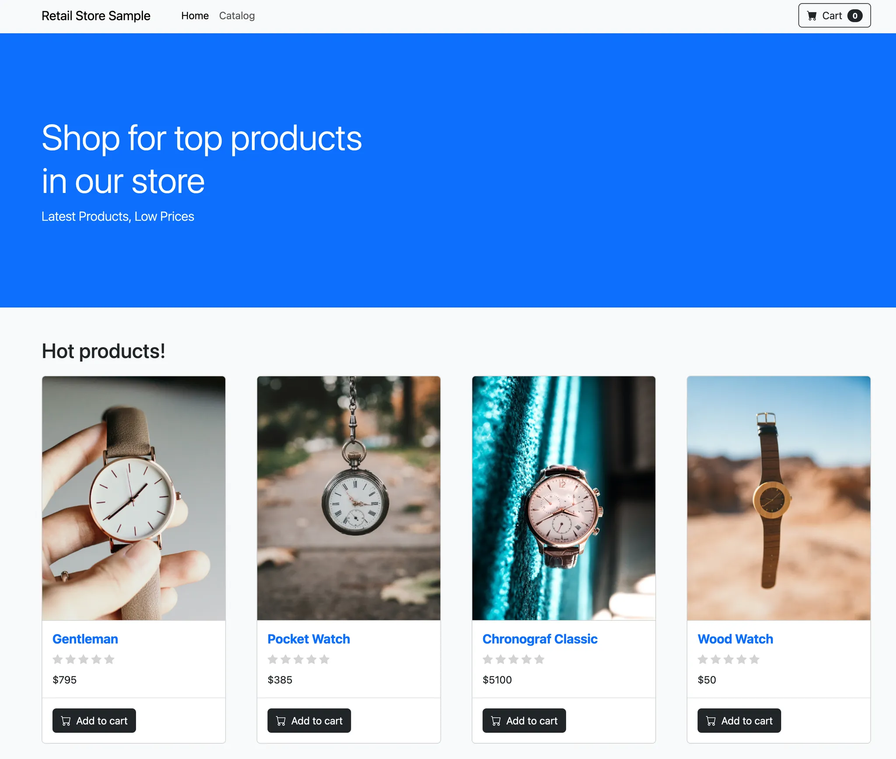

In this section, we'll enable ECS Service Connect in our cluster by deploying two additional microservices that the UI service will communicate with:


*Figure 1. AWS FCS service Connect Architecture*

#### Deploy the Assets service

Create an ECS task definition for the **Assets service**.

    ```bash
    cat << EOF > retail-store-ecs-asset-taskdef.json
    {
        "family": "retail-store-ecs-assets",
        "executionRoleArn": "arn:aws:iam::${ACCOUNT_ID}:role/retailStoreEcsTaskExecutionRole",
        "networkMode": "awsvpc",
        "requiresCompatibilities": [
            "FARGATE"
        ],
        "cpu": "1024",
        "memory": "2048",
        "runtimePlatform": {
            "cpuArchitecture": "X86_64",
            "operatingSystemFamily": "LINUX"
        },
        "containerDefinitions": [
            {
                "name": "application",
                "image": "public.ecr.aws/aws-containers/retail-store-sample-assets:0.7.0",
                "cpu": 0,
                "portMappings": [
                    {
                        "name": "application",
                        "containerPort": 8080,
                        "hostPort": 8080,
                        "protocol": "tcp",
                        "appProtocol": "http"
                    }
                ],
                "essential": true,
                "healthCheck": {
                    "command": [
                        "CMD-SHELL",
                        "curl -f http://localhost:8080/health.html || exit 1"
                    ],
                    "interval": 10,
                    "timeout": 5,
                    "retries": 3,
                    "startPeriod": 60
                },
                "logConfiguration": {
                    "logDriver": "awslogs",
                    "options": {
                        "awslogs-group": "retail-store-ecs-tasks",
                        "awslogs-region": "$AWS_REGION",
                        "awslogs-stream-prefix": "assets-service"
                    }
                }
            }
        ]
    }
    EOF
    
    aws ecs register-task-definition --cli-input-json file://retail-store-ecs-asset-taskdef.json
   ```
    

Create the corresponding Assets ECS service:

   ```bash
    aws ecs create-service \
        --cluster retail-store-ecs-cluster \
        --service-name assets \
        --task-definition retail-store-ecs-assets \
        --desired-count 1 \
        --launch-type FARGATE \
        --network-configuration "awsvpcConfiguration={subnets=[${PRIVATE_SUBNET1}, ${PRIVATE_SUBNET2}], securityGroups=[$ASSET_SG_ID],assignPublicIp=DISABLED}" \
        --service-connect-configuration '{
            "enabled": true,
            "namespace": "retailstore.local",
            "services": [
                {
                    "portName": "application",
                    "discoveryName": "assets",
                    "clientAliases": [
                        {
                            "port": 80,
                            "dnsName": "assets"
                        }
                    ]
                }
            ]
        }'
   ```
    

Note that when we create this service, we specify `--service-connect-configuration`, which:

1.  Enables Service Connect
2.  Specifies a namespace that all the services will share
3.  Configures the Service Connect services that will be provided by this ECS service, including its alias and port number

[For more information, refer to the AWS documentation.](https://docs.aws.amazon.com/AmazonECS/latest/developerguide/networking-connecting-services.html#networking-connecting-services-serviceconnect) 

#### Deploy the Catalog service


Create an ECS task definition for the **Catalog service**.

   ```
    cat << EOF > retail-store-ecs-catalog-taskdef.json
    {
        "family": "retail-store-ecs-catalog",
        "executionRoleArn": "arn:aws:iam::${ACCOUNT_ID}:role/cataologEcsTaskExecutionRole",
        "networkMode": "awsvpc",
        "requiresCompatibilities": [
            "FARGATE"
        ],
        "cpu": "1024",
        "memory": "2048",
        "runtimePlatform": {
            "cpuArchitecture": "X86_64",
            "operatingSystemFamily": "LINUX"
        },
        "containerDefinitions": [
            {
                "name": "application",
                "image": "public.ecr.aws/aws-containers/retail-store-sample-catalog:0.7.0",
                "portMappings": [
                    {
                        "name": "application",
                        "containerPort": 8080,
                        "hostPort": 8080,
                        "protocol": "tcp",
                        "appProtocol": "http"
                    }
                ],
                "essential": true,
                "environment": [
                    {
                        "name": "DB_NAME",
                        "value": "catalog"
                    }
                ],
                "secrets": [
                    {
                        "name": "DB_ENDPOINT",
                        "valueFrom": "arn:aws:ssm:${AWS_REGION}:${ACCOUNT_ID}:parameter/retail-store-ecs/catalog/db-endpoint"
                    },
                    {
                        "name": "DB_PASSWORD",
                        "valueFrom": "arn:aws:secretsmanager:${AWS_REGION}:${ACCOUNT_ID}:secret:retail-store-ecs-catalog-db:password::"
                    },
                    {
                        "name": "DB_USER",
                        "valueFrom": "arn:aws:secretsmanager:${AWS_REGION}:${ACCOUNT_ID}:secret:retail-store-ecs-catalog-db:username::"
                    }
                ],
                "healthCheck": {
                    "command": [
                        "CMD-SHELL",
                        "curl -f http://localhost:8080/health || exit 1"
                    ],
                    "interval": 10,
                    "timeout": 5,
                    "retries": 3,
                    "startPeriod": 60
                },
                "logConfiguration": {
                    "logDriver": "awslogs",
                    "options": {
                        "awslogs-group": "retail-store-ecs-tasks",
                        "awslogs-region": "$AWS_REGION",
                        "awslogs-stream-prefix": "catalog-service"
                    }
                }
            }
        ]
    }
    EOF
    
    aws ecs register-task-definition --cli-input-json file://retail-store-ecs-catalog-taskdef.json
   ```
    

Create the corresponding Catalog ECS service:

   ```bash
    aws ecs create-service \
        --cluster retail-store-ecs-cluster \
        --service-name catalog \
        --task-definition retail-store-ecs-catalog \
        --desired-count 1 \
        --launch-type FARGATE \
        --network-configuration "awsvpcConfiguration={subnets=[${PRIVATE_SUBNET1}, ${PRIVATE_SUBNET2}], securityGroups=[$CATALOG_SG_ID],assignPublicIp=DISABLED}" \
        --service-connect-configuration '{
            "enabled": true,
            "namespace": "retailstore.local",
            "services": [
                {
                    "portName": "application",
                    "discoveryName": "catalog",
                    "clientAliases": [
                        {
                            "port": 80,
                            "dnsName": "catalog"
                        }
                    ]
                }
            ]
        }'
   ```
    


#### Updating the UI service

Before updating the UI service, let's wait for the new services to finish deploying (**~ 2 min**):
   ```bash
    aws ecs wait services-stable --cluster retail-store-ecs-cluster --services catalog
    aws ecs wait services-stable --cluster retail-store-ecs-cluster --services assets
   ```

The following environment variables need to be added to the UI task definition to link the UI service with the Catalog and Asset services:

   ```json
    "environment": [
        {
            "name": "ENDPOINTS_CATALOG",
            "value": "http://catalog"
        },
        {
            "name": "ENDPOINTS_ASSETS",
            "value": "http://assets"
        }
    ]
   ```

Update the **UI task definition** with the environment variables:

   ```bash
    cat << EOF > retail-store-ecs-ui-connect-taskdef.json
    {
        "family": "retail-store-ecs-ui",
        "executionRoleArn": "arn:aws:iam::${ACCOUNT_ID}:role/retailStoreEcsTaskExecutionRole",
        "taskRoleArn": "arn:aws:iam::${ACCOUNT_ID}:role/retailStoreEcsTaskRole",
        "networkMode": "awsvpc",
        "requiresCompatibilities": [
            "FARGATE"
        ],
        "cpu": "1024",
        "memory": "2048",
        "runtimePlatform": {
            "cpuArchitecture": "X86_64",
            "operatingSystemFamily": "LINUX"
        },
        "containerDefinitions": [
            {
                "name": "application",
                "image": "public.ecr.aws/aws-containers/retail-store-sample-ui:0.7.0",
                "portMappings": [
                    {
                        "name": "application",
                        "containerPort": 8080,
                        "hostPort": 8080,
                        "protocol": "tcp",
                        "appProtocol": "http"
                    }
                ],
                "essential": true,
                "linuxParameters": {
                    "initProcessEnabled": true
                },
                "environment": [
                    {
                        "name": "ENDPOINTS_CATALOG",
                        "value": "http://catalog"
                    },
                    {
                        "name": "ENDPOINTS_ASSETS",
                        "value": "http://assets"
                    }
                ],
                "healthCheck": {
                    "command": [
                        "CMD-SHELL",
                        "curl -f http://localhost:8080/actuator/health || exit 1"
                    ],
                    "interval": 10,
                    "timeout": 5,
                    "retries": 3,
                    "startPeriod": 60
                },
                "logConfiguration": {
                    "logDriver": "awslogs",
                    "options": {
                        "awslogs-group": "retail-store-ecs-tasks",
                        "awslogs-region": "$AWS_REGION",
                        "awslogs-stream-prefix": "ui-service"
                    }
                }
            }
        ]
    }
    EOF
    
    aws ecs register-task-definition --cli-input-json file://retail-store-ecs-ui-connect-taskdef.json
   ```
    

Now update the UI service with the new task definition (**~ 5 min**):

   ```bash
    aws ecs update-service \
        --cluster retail-store-ecs-cluster \
        --service ui \
        --task-definition retail-store-ecs-ui \
        --force-new-deployment \
        --service-connect-configuration '{
            "enabled": true,
            "namespace": "retailstore.local",
            "services": [
                {
                    "portName": "application",
                    "discoveryName": "ui",
                    "clientAliases": [
                        {
                            "port": 80,
                            "dnsName": "ui"
                        }
                    ]
                }
            ]
        }'
    
    echo "Waiting for service to stabilize..."
    
    aws ecs wait services-stable --cluster retail-store-ecs-cluster --services ui
   ```

#### Explore Web Application

Since we've deployed not only the UI service but also the Assets and Catalog services, the application's appearance has slightly changed.
   
   ```bash
    export RETAIL_ALB=$(aws elbv2 describe-load-balancers --name retail-store-ecs-ui \
     --query 'LoadBalancers[0].DNSName' --output text)
    
    echo http://${RETAIL_ALB} ; echo
   ```

Paste the URL into a web browser to access the application.

Now that we deployed `assets` and `catalog` services, the web application will also display the product images; like in the screenshot below:


*Figure 2. Web browser*