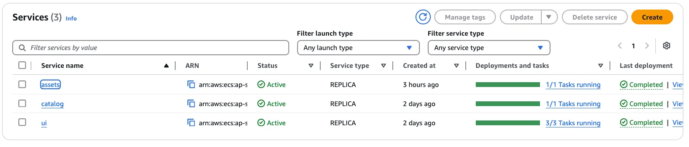
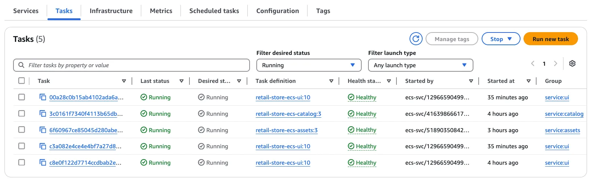
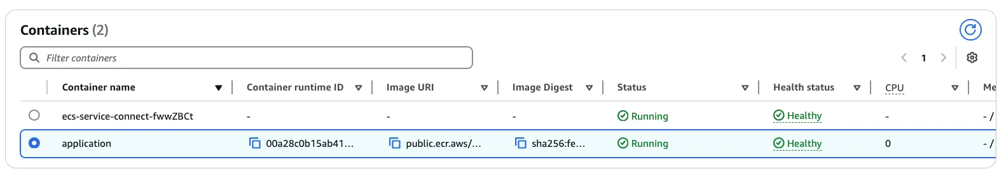
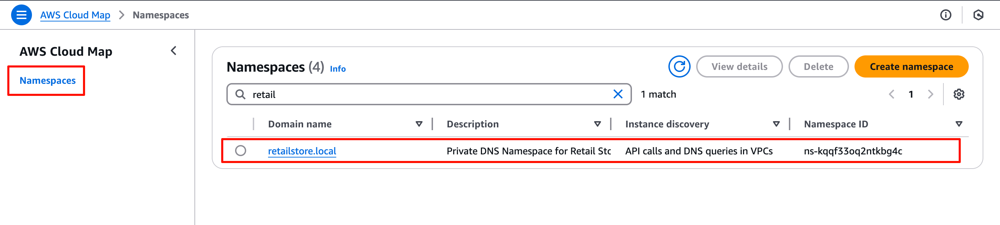
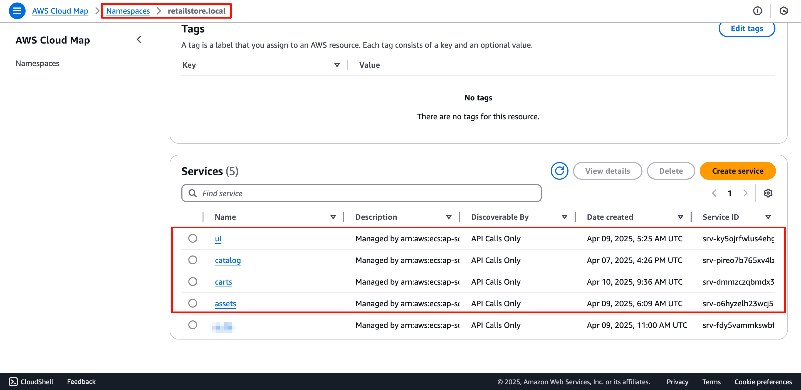

Open the Amazon ECS console to inspect the services.

[Open Amazon ECS console](https://console.aws.amazon.com/ecs/v2/clusters/retail-store-ecs-cluster/services)

You'll now see three services running in the cluster:

*Figure 1. Cluster Service List*

Navigating to the **Tasks** tab will show multiple tasks running:

*Figure 2. Cluster Task List*

Select one of the running tasks and scroll down to the **Containers** section. In the screen below, you can see the `application` and the `ecs-service-connect` containers. [More information can be found here.](https://docs.aws.amazon.com/AmazonECS/latest/developerguide/service-connect-concepts.html#service-connect-concepts-proxy) 

Since we also enabled Amazon GuardDuty for runtime monitoring in Amazon ECS, you can also see the `aws-guardduty-agent` container. [More information on Amazon GuardDuty can be found here](https://aws-fcj-ecs-workshop.github.io/Amazon-ECS-Immersion-Day/security/)

*Figure 3. Cluster Task Containers*

#### The Namespace

Service Connect uses [AWS Cloud Map](https://aws.amazon.com/cloud-map/)  namespaces as a logical grouping of Amazon ECS tasks that communicate with one another. Each Amazon ECS service can belong to only one namespace. The services within a namespace can be spread across different Amazon ECS clusters within the same AWS Region in the same AWS account.

To review the Cluster Namespaces, open the Amazon ECS dashboard and select **Namespace** from the side navigation bar.

*Figure 4. Cluster Namespace*

Select a namespace to review the details of the AWS Cloud Map configuration associated with each service. The **Discovery Name** represents the associated short name that can be used to connect to the service for services running in the same namespace (e.g., `http://assets`).

*Figure 4. Services in **retailstore.local** namespace*
