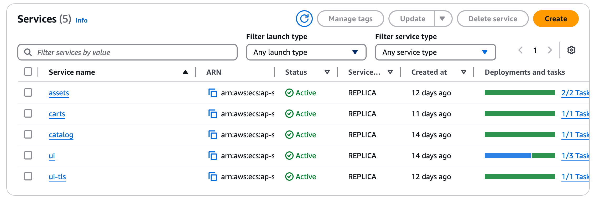
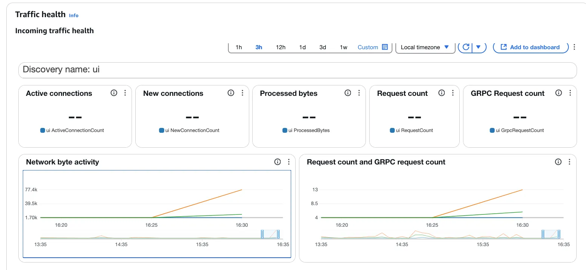
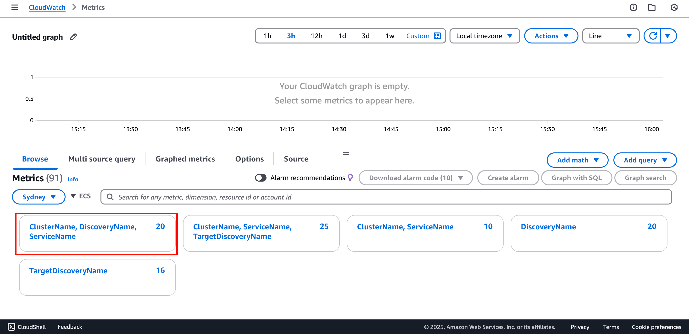
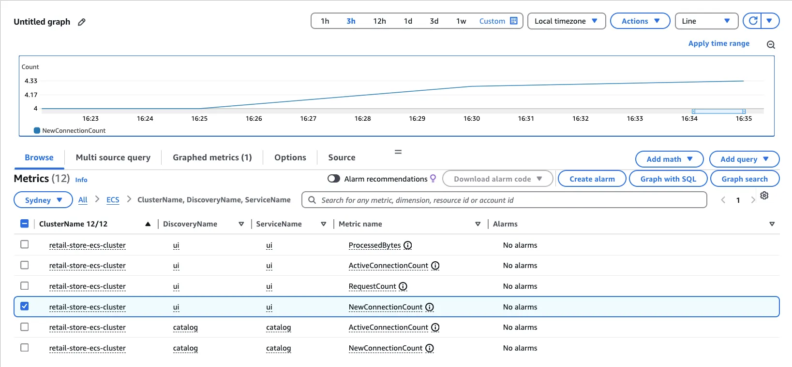

Now let's review the metrics that Service Connect makes available.

Amazon ECS provides CloudWatch metrics you can use to monitor your resources. [Review the full list of available metrics here](https://docs.aws.amazon.com/AmazonECS/latest/developerguide/available-metrics.html) .

Execute the following command to generate some synthetic traffic:

```bash
    export RETAIL_ALB=$(aws elbv2 describe-load-balancers --name retail-store-ecs-ui \
      --query 'LoadBalancers[0].DNSName' --output text)
    
    hey -n 1000000 -c 1 -q 10 http://$RETAIL_ALB/home &
```


#### Review ECS Service Connect metric on the Traffic Health dashboard

Open the Amazon ECS Console, select the `retail-store-ecs-cluster`, and navigate to the Service tab.



Select the `ui` service and scroll down to the **Traffic Health** dashboard.

Amazon ECS sends metrics to CloudWatch every minute. When collecting metrics, Amazon ECS gathers multiple data points per minute. [More information can be found here](https://docs.aws.amazon.com/AmazonECS/latest/developerguide/available-metrics.html) 



Amazon ECS configures tasks and containers so that applications only connect to the proxy if the application is connecting to endpoint names in the same namespace. All other traffic bypasses the proxy. This includes IP addresses in the same VPC, AWS service endpoints, and external traffic. [More information can be found here](https://docs.aws.amazon.com/AmazonECS/latest/developerguide/service-connect-concepts-deploy.html#service-connect-concepts-proxy) . This explains why you won't find outgoing traffic for the `Assets` and `Catalog` services.

#### Review ECS Service Connect metric on Amazon CloudWatch

Open the [Amazon CloudWatch metrics](https://console.aws.amazon.com/cloudwatch/home#metricsV2?graph=~(view~'timeSeries~stacked~false~stat~'Average~period~300)&namespace=~'AWS*2fECS)  console:



Click on the **Cluster, DiscoveryName, ServiceName** metrics and search for `ui` to review the traffic metrics.



You can also explore **Cluster, ServiceName, TargetDiscoveryName** for additional metrics.

To stop the synthetic traffic generation, execute the following command:

    pkill -9 hey