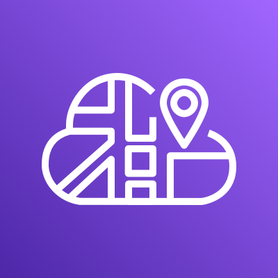

{}
You must have completed the following chapters as pre-requisites for this lab: [Fundamentals](https://aws-fcj-ecs-workshop.github.io/Amazon-ECS-Immersion-Day/fundamentals/)
{}

**ECS Service Connect** is the recommended approach for handling service-to-service communication, offering features such as service discovery, connectivity, and traffic monitoring. With Service Connect, your applications can utilize short names and standard ports to connect to ECS services within the same cluster, across different clusters, and even across VPCs within the same AWS Region. [For more detailed information, please refer to the AWS documentation.](https://docs.aws.amazon.com/AmazonECS/latest/developerguide/networking-connecting-services.html#networking-connecting-services-serviceconnect) 

Alternative options for configuring inter-service communication within Amazon ECS Services include:

*   [Internal Load Balancer](https://docs.aws.amazon.com/AmazonECS/latest/developerguide/networking-connecting-services.html#networking-connecting-services-elb) 
*   [Service Discovery](https://docs.aws.amazon.com/AmazonECS/latest/developerguide/networking-connecting-services.html#networking-connecting-services-direct) 
*   [Amazon VPC Lattice](https://docs.aws.amazon.com/AmazonECS/latest/developerguide/ecs-vpc-lattice.html) 
