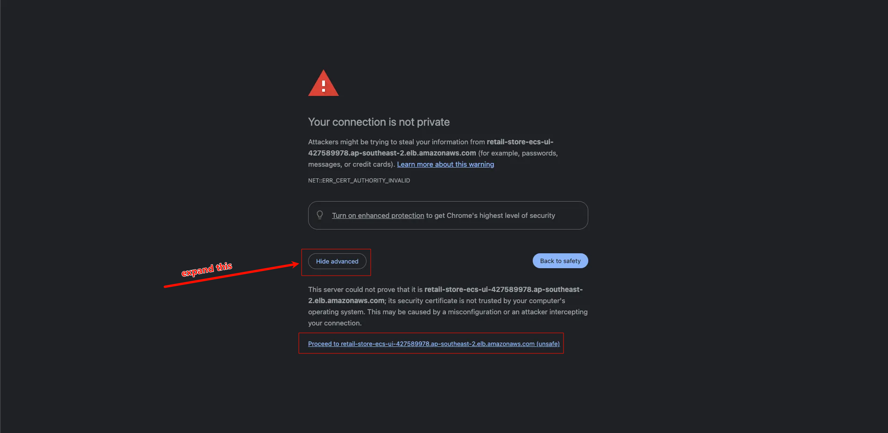
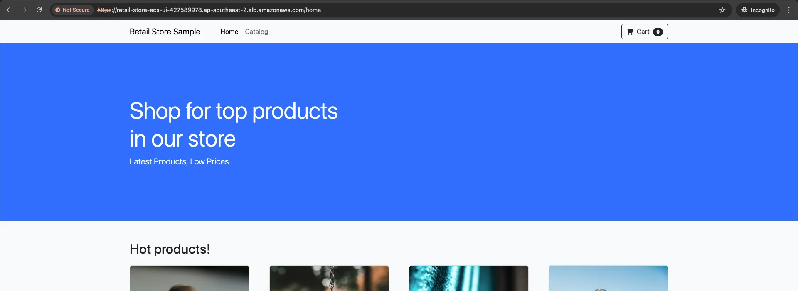

In this section, we will deploy the UI service with TLS enabled ECS Service Connect and explore this service via HTTPS endpoint.

#### Deploy the UI service with TLS enabled in ECS Service Connect

We are now ready to set up the new **ui-tls** service with ECS Service Connect, ensuring TLS encryption is enabled.

```bash
    export ECS_SERVICE_CONNECT_ROLE_ARN=$(aws iam get-role --role-name ecs-service-connect-certificate-role --query Role.Arn --output text)
```

Let's create the ECS service:

```bash
    aws ecs create-service \
        --cluster retail-store-ecs-cluster \
        --service-name ui-tls \
        --task-definition retail-store-ecs-ui \
        --desired-count 1 \
        --enable-execute-command \
        --launch-type FARGATE \
        --load-balancers targetGroupArn=${UI_TARGET_GROUP_TLS_ARN},containerName=application,containerPort=8080 \
        --network-configuration "awsvpcConfiguration={subnets=[${PRIVATE_SUBNET1},${PRIVATE_SUBNET2}],securityGroups=[${UI_SG_ID}],assignPublicIp=DISABLED}" \
        --service-connect-configuration '{
            "enabled": true,
            "namespace": "retailstore.local",
            "services": [
                {
                    "portName": "application",
                    "discoveryName": "ui-tls",
                    "clientAliases": [
                        {
                            "port": 80,
                            "dnsName": "ui-tls"
                        }
                    ],
                    "tls": {
                      "issuerCertificateAuthority": {
                        "awsPcaAuthorityArn": "'${CERTIFICATE_AUTH_ARN}'"
                      },
                      "roleArn": "'${ECS_SERVICE_CONNECT_ROLE_ARN}'"
                    }
                }
            ]
        }'
```

You can wait for the service to stabilize using the AWS CLI (**~ 2 min**):

```bash
    echo "Waiting for service to stabilize..."
    
    aws ecs wait services-stable --cluster retail-store-ecs-cluster --services ui-tls
```

#### Review the new web application via the HTTPS endpoint

For this workshop, we used a self-signed certificate that will be considered invalid by your browser.

Once the new **UI-TLS** service has been deployed, we can review the running application over **HTTPS**.

```bash
    export RETAIL_ALB=$(aws elbv2 describe-load-balancers --name retail-store-ecs-ui \
     --query 'LoadBalancers[0].DNSName' --output text)
    
    echo https://${RETAIL_ALB} ; echo
```

As shown in the image below, click the **Advanced** button and then click the link at the bottom stating `Proceed to retail-store-ecs-ui-XXXXXXXXXXX.us-west-2.elb.amazonaws.com (unsafe)`.


*Figure 1. Invalid Certificate Advanced*

After accessing the application, you should see the following page:


*Figure 2. App Home page with TLS enabled*