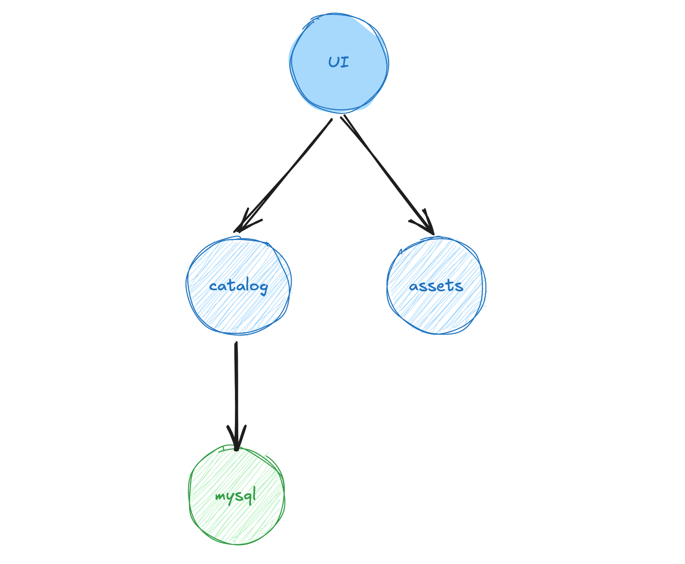

# Networking

Modern applications, like our sample application, are typically built out of multiple distributed components that communicate with each other. For example, the UI component communicates via API with the Catalog component, which is linked to a persistent layer on MySQL, as shown in the architecture diagram below.

*Figure 1. ECS Microservices Architecture*

In this chapter, we will explore relevant Amazon ECS networking concepts related to Fargate. Understanding these concepts is crucial for effectively designing and deploying containerized applications on AWS.

*   [📘 Amazon ECS Network Mode](1-network-mode/)
*   [📘 ECS Service Connect](2-service-connect/)
*   [📘 Amazon ECS Service Connect with TLS](3-service-connect-with-tls/)