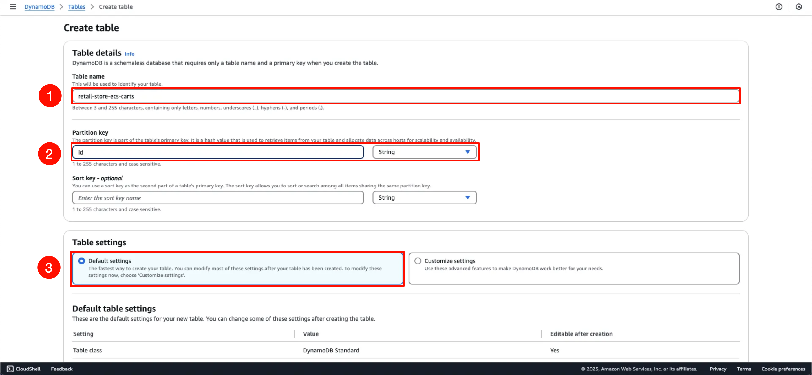
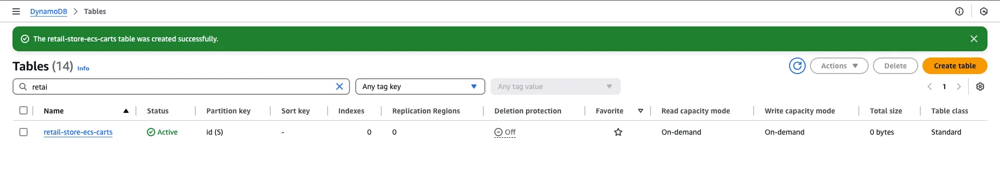

In this section, we will create a DynamoDB table to store shopping cart details.

{}
Use the exact table and index names specified below, as they will be referenced in AWS CLI commands later.
{}

#### Creating the DynamoDB Table

1. Navigate to the **DynamoDB** service in the AWS Management Console and select **Create table**

2. Configure the following table settings:
   * Table name: `retail-store-ecs-carts`
   * Partition key: `id` (String)
   * Leave all other settings as default

*Figure 2: DynamoDB table creation settings*

3. Once created, you will see the table status as "Active"

*Figure 3: Successfully created DynamoDB table*

#### Adding a Global Secondary Index

1. In the `retail-store-ecs-carts` table details page, select the **Indexes** tab and click **Create index**

2. Configure the index with these settings:
   * Partition key: `customerId` (String)
   * Index name: `idx_global_customerId`

*Figure 4: Creating a global secondary index*